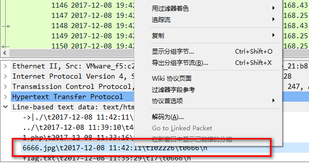
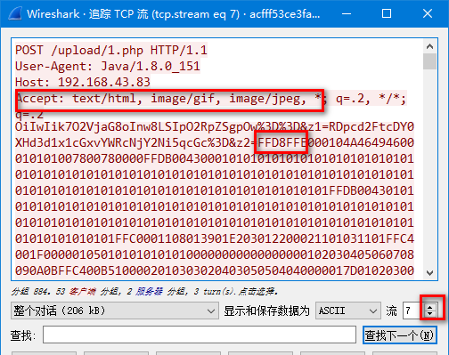
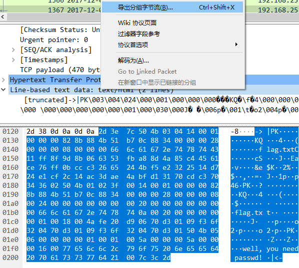
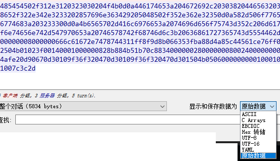

[TOC]

# CTF 相关工具
## python

https://www.python.org/ftp/python/3.8.1/python-3.8.1.exe
https://www.python.org/ftp/python/3.5.2/python-3.5.2.exe
https://www.python.org/ftp/python/2.7.16/python-2.7.16.msi

## Burpsuit
### 准备文件
常用字典 https://github.com/rootphantomer/Blasting_dictionary

### 使用方法 
可以默认把intercept关闭, 直接用history, 全选包内容, send to repeater

查看端口: proxy-options

拦截记录: proxy-http history
## Winhex

Q： 怎样粘贴 FFD8 为16进制？
A： Shift+Insert 选ascii-hex。 

### 常用技巧
底部状态栏，会显示偏移位，10进制。
### 快捷键
Ctrl+F时查找时列出更多结果

Ctrl+C 复制
Shift+Ctrl+C 复制16进制

Ctrl+B 粘贴，不进行偏移（菜单编辑-剪贴板数据-写入）

选区域
  Alt+1 右击选块起始
  Alt+2 右击选块结束

dump选区？

点击左侧地址栏，切换10/16进制
### 常用设置 

工具 - 数据解释器， 可以勾选 各种要显示的类型。

在界面上右击数据解释器，可以选 Big Endian。

## 010 Editor

分析 jpg。 打开后按提示install或 菜单: Template - Repository , jpg - install

分析到 char unknownPadding， 使用dd分离。

    dd if=logo.jpg of=2-1.jpg skip=$((0x7011)) bs=1 # 7011是起始地址

或 右击hex窗口中的选中区域，，右击 selection-save selection

## Wireshark - 浏量数据分析

https://bbs.pediy.com/thread-254463.htm

方法 1. 统计 - 协议分级统计·

方法 2. 文件-导出对象-HTTP

方法 3. 搜索Flag

Kali中 strings easy.pcap | grep flag

方法 4. snmp 网管协议 过滤后 右击follow - udp stream。

搜索字符串 Ctrl+F, 输入字符串， 最左侧选 packet byte. 即可搜索所有字符

过滤协议  Ctrl+/ , 输入协议名回车常见有 tcp udp icmp(ping扫描等) 等

### 怎样从流中 追踪指定文件？
在分组列表，右击某文件行。点击追踪流-TCP流。例 6666.jpg

这时流里会有多个文件。jpg文件 为FFD8开头FFD9结尾。 根据header和传输内容来确定。

点击流 右侧的上下箭头来切换流里的文件。直到找到它。

### 手动提取zip
已知有zip文件了，Ctrl+F，左侧选16进制值，搜索 504B0304，搜到1个结果。

1.1 在分组列表的 Line-based text data，点击就已经选中PK部分。右击-导出分组字节流 123.zip。

1.2 或者右击分组列表， 追踪TCP流。 来到最下面看到PK了。 点击显示和保存数据为-原始存储。 选中最后蓝色部分，到winhex里粘贴为ascii-hex。从PK头截取存为zip。

