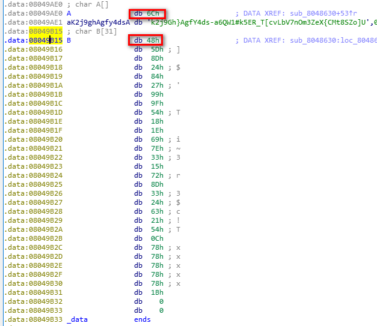
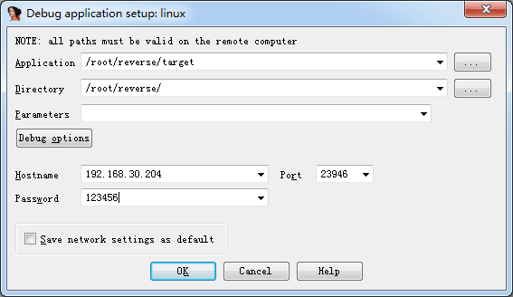

[TOC]
# Q1 

x64dbg 载入后为什么不在入口 在7xxxx地址。

# 逆向

## 解题思路
1. winhex直接搜flag

2. 用 exeinfo pe 查壳。

        ELF文件，用winhex打开搜下是不是upx
        如果提示 yoda's Protector, 有可能是UPX壳， 扔到 winhex 搜到UPX，搜到为UPX壳。

    2.1 如果是upx用upx -d filename 脱壳

2. 没壳拖入IDA和OD

遇到 __debugbreak() 汇编窗口看是 int ,3 ， 可能需要nop掉。

如果 v3 == 125 这种, IDA中按R转成字符看看。

### 代码阅读 

byte型保留0xff，可以用 `& 0xff` 或 `% 0x100`

### 数据处理
大整数注意可能是小端存储，要倒序过来。

wchar_t 16位或32位。

## 查看文件信息

Linux下 file xxxx

## Tools
python/pyc 反编译 https://github.com/rocky/python-uncompyle6/releases

## IDA使用
### 环境配置 
python配置

### 常用方式
* 将文件丢入IDA，定位main函数，F5

* 只有一个信息框从弹窗下手

```
    1.搜索message  API：View-Imports ，底下的搜索栏搜 message, 看到MessageBoxW
    2.双击进去，Ctrl+X查看调用，发现没有被调用，于是放过
    3.弹窗有可能为窗口类，搜索window --- ShowWindow
```

连续的定义， 可试着在汇编窗口看。

Feature | Description|Menu|Windows
--|--|--|--
数字转字符 | 右击 - Char, 字串-大端存储的，需倒序。在hex dump里看是正常的 || <kbd>R</kbd>
导出数据 | 双击变量进入, 选中数据后 导出 => C unsign char array decimal |Edit - Export data | <kbd>Shift</kbd> <kbd>E</kbd>
切换变量大小| 双击变量进入的 反汇编数据窗口，点击变量 |右击-Data | <kbd>D</kbd> 可切换 Byte, Word, Dword
显示数组大小| 双击变量进入的 反汇编数据窗口，点击变量 |右击变量-Array| 按*键

如果它函数反编译出来的变量很奇怪，可以将这个函数undefine掉然后再define，这样看的变量就会正常很多

Alt+D, Setup Data types
#### 执行Python脚本

Description|Menu|Windows
--|--|--
执行Python脚本| `File - Sript File` | <kbd>Alt</kbd><kbd>F7</kbd>
Python命令窗口| `File - Sript Command` <br>Script Language选Pyhon| <kbd>Shift</kbd><kbd>F2</kbd>

##### Python 脚本示例
[Link](https://www.52pojie.cn/thread-1117330-1-1.html)

打印Dword地址值
```python
addr=0x08048A90 # 数组的地址
arr=[]
for i in range(6): # 数组的个数
    arr.append(Dword(addr+4*i))
print(arr)
```
#### 大端与小端 

假设一个十六进制数0x12345678

大端的存储方式是：12,34,56,78，然后读取的时候也是从前往后读

小端的存储方式是：78,56,34,12，然后读取的时候是从后往前读取

### FAQ
Q: 怎样从伪代码(F5)返回到 汇编代码
A: 按tab, 右击图 text view

Q: IDA，怎样在图(Proximity Browser)中展开显示子函数的汇编
A: space键 : 切换 graph view 和 text mode

### 快捷键

Esc 后退

Enter 进入

G jump to address

Shift+F12 查看文本

F5 反汇编成代码

Ctrl+X 查看调用

C 显示为代码

A 显示为String

显示为Array：　双击变量，进入反汇编窗口按*
### 变量显示

翻译
    
    A[(unsigned __int8)((unsigned __int8)B[i] / 3u - 2)] ) 等于
    A[B[i] / 3 - 2]



注意 0x6c和 0x68也要包含进来

    a = 'lk2j9Gh}AgfY4ds-a6QW1#k5ER_T[cvLbV7nOm3ZeX{CMt8SZo]'
    b = [0x48, 0x5D, 0x8D, ..., 0x1B, 0, 0]

#### 快速选中连续的bytes
定位好后，Ctrl+1, hex dump, 然后再选
#### 如何查看 函数地址
在函数窗口选中函数后 Ctrl+E
### 使用 Patch Program
1.伪代码窗口中 选中要使用Patch的位置，

    1.1 直接Ctrl+Alt+K 或
    1.2 按Tab, 进入反汇编窗口,  菜单 Edit-KeyPatch (Ctrl+Alt+K)
    1.2.1 或 反汇编窗口 Edit-"Patch Program"-Assemble

2. 修改，菜单 Edit-"Patch Program" - Apply Patches to input file.

### 使用远程调试

Windows 下的 IDA     

1. 在 IDA 的安装目录/dbgsrc/找到 linux_server 和 linux_serverx64 拷贝到 linux 虚拟机中
2. 在 linux 中运行 linux_server 并在 linux 中运行要调试的 demo
3. Debugger -- Attach -- Remote Linux debbuger

4. 配置客户端调试选项

路径默认是 linux_server 的位置, 放在同文件夹下可直接使用文件名。 否则使用全路径名。 / 开头

比如, /mnt/hgfs/vmware/dbg/runthis 或直接使用 runthis

配置好调试的服务端后，接下来开始配置客户端IDA，正常启动IDA打开【Debugger】-【Run】-【Remote Linux debugger】来设置调试选项

Debugger - Process Option



#### 调试常用

Description|Key binding
--|--
Step into|<kbd>F7</kbd>
Step over|<kbd>F8</kbd>

菜单 `Debugger - Debugger Windows - Watch View`


## android apk, java 

android 可以在strings.xml中找到字符串的值。

ida android 调试 [L1](https://www.jianshu.com/p/16e9966817c5)  [L2](https://www.jianshu.com/p/16e9966817c5)
## java 反编译

### jd-gui
Bug: 如果打不开class文件，多半是类名和文件名不一致。可以先新建一个hi.java，然后把class文件放到此文件夹，用jd-gui打开 hi.java， class文件就能正常显示了。

### Jeb
拉进入后，右击main, 解析(Decompiler)

### anrdoid killer
重新打包-- 菜单-android 批量编译

### Android reverse

#### jni, native关键字和so文件

https://blog.csdn.net/re_psyche/article/details/83790851
https://blog.csdn.net/getsum/article/details/85217885

解压后用jeb打开mainactivity， 解析，调用了 hellolib

发现关键函数是 native 的，所以要查看hellolib.so文件。

jeb里找到后用16进制查看。向下翻页找DDCTF****@***.com 即flag.（或者winhex打开，然后搜索ctf找到flag）

## Ollydbg
插件-搜索-中文-unicode  里面找有没有你赢了，flag等相关字，
[调试子进程](https://blog.csdn.net/darcy_123/article/details/101552444)

### FAQ
Q:如何加入参数调试？

A:菜单:调试-参数

Q: 怎样删除硬件断点？ 

A: 调试-硬件断点
### 快捷键

F4 运行到光标位置

F2 断点

Ctrl+G 转到表达式 400001

Ctrl+S 查找命令序列

Ctrl+B 查找二进制


1-9 -- NOP 1-9个字节

Alt+Bksp -- 撤销修改

寄存器窗口 Z 位关系到跳转

左下角 M1-M5

      记录你当前内存操作最后一次的位置及 显示格式    
      选中M1  ： dd  00401000 
      选中M2：  db 00401020 
      选中M3：  让内存以字符串形式显示 
      接着你切换 M1 M2 M3就发现内存的显示

条件断点

    eax == 040000
    eax == 25 , 表示的是 0x25
    堆栈窗口右击-地址-相对于ESP，如要记录Conditional_bp.exe调用CreateFileA函数的情况，在CreateFileA函数的第一行，按Shift+F4键 [STRING[ESP+4]]=="c:\\1212.txt"
    CreateFIleW函数地址处，按下Shift+F2，输入条件：[UNICODE[esp+4]]=="C:\\Test\\123.txt"

### 条件断点

Shift+F2, eax == 0400000
### TODO
是否支持

    bp main
    bp kernel32!createprocess
    bp [apiname]


## angr 二进制框架

[L1](https://blog.csdn.net/xiangshangbashaonian/article/details/82825488) [L2](https://www.freebuf.com/sectool/143056.html)

__示例1: WhaleCTF题目 r100__

```python
import angr
proj = angr.Project("./r100",auto_load_libs=False)
state = proj.factory.entry_state()
simgr = proj.factory.simgr(state) 
simgr.explore(find=0x400844,avoid=0x400855) # 0x400844 =>输出正确答案的地址, 0x400855 错误跳转到erorr的地址
a = simgr.found[0].posix.dumps(0)
print(a) # 直接跑出答案
```

__示例2:  [ais3_crackme](https://github.com/angr/angr-doc/raw/master/examples/ais3_crackme/ais3_crackme)__

这个是需要跟参数的, 

通过claripy模块，来构造输入。claripy是一个符号求解引擎和z3类似，我们完全可以将其当成是z3进行使用。

claripy关于变量的定义在claripy.ast.bv.BV当中

通常使用claripy.BVS()创建位向量符号

```python
import angr   #导入angr
import claripy    #导入claripy
proj = angr.Project("./ais3_crackme")    #载入文件
argv1 = claripy.BVS('argv1',50*8)    #B是bit 1字节=8bit  猜测输入不多于50字节 就是50*8
state = proj.factory.entry_state(args=['./ais3_crackme',argv1])
simgr = proj.factory.simgr(state)
simgr.explore(find=0x400602,avoid=0x40060E)    #成功位置及失败位置
print(simgr.found[0].solver.eval(argv1))    #转成ascll码输出
print(simgr.found[0].solver.eval(argv1,cast_to=bytes))    #直接输出字符

```

## 脱壳、常见壳

### upx壳

kali中自带 `upx -d filename`

手动脱壳1

    直接CTRL+F，输入popad
    0040EA0E     61            popad                 //F2下断，F9运行，F2取消断点，单步F8
    0040EA0F   - E9 B826FFFF   jmp NOTEPAD.004010CC

手动脱壳1-esp定律

遇到向上跳转的jz等向上跳循环，直接移到下一行F4.

F8单步找到 pushad的下一句，看右侧寄存器窗口ESP变红，

1.右击ESP - HW Break [ESP]

    方式 1.1 或在数据窗口跟随，此时，在数据窗口中，右单击“数值”，选择“断点”->“设置硬件访问断点”->“Word”，按 Shift+F9
    方式 1.2 https://www.52pojie.cn/forum.php?mod=viewthread&tid=314918
    1.2.1 或 来到pushad语句后， 在命令行下断hr esp-4（此时的ESP就是OD载入后当前显示的值）
    1.2.2 hr ESP(关键标志下一行代码所指示的ESP值(单步通过))

2.F9运行。继续单步，直到下一行是JMP之类的跳过去，看到像程序入口的地方,右击，用ollydump脱壳将程序DUMP出来即可，如

      0040EA0F   - E9 B826FFFF     jmp UPX.004010CC
      0040EA14     0000            add byte ptr ds:[eax],al
      0040EA16     0000            add byte ptr ds:[eax],al
      0040EA18     0000            add byte ptr ds:[eax],al
      0040EA1A     0000            add byte ptr ds:[eax],al
      0040EA1C     0000            add byte ptr ds:[eax],al

     此时，再按F8,便来到了OEP处，DUMP程序。

## Wiki
### 内存相关知识 

扩展的存储单位有：

计算机存储容量大小以字节数来度量，1024进位制：

    1024B=1K(千)B  
    1024KB=1M(兆)B 
    1024MB=1G(吉)B 
    1024GB=1T(太)B 

　　 这是常用的五个，至于PB，EB，ZB，YB，BB，NB，DB几乎在日常使用中是不会遇到的。

　　

而Int8，Int16，Int32，nt64，后面的数字就代表这个数据类型占据的空间。

    Int8, 等于Byte, 占1个字节.
    Int16, 等于short, 占2个字节. -32768 32767
    Int32, 等于int, 占4个字节. -2147483648 2147483647
    Int64, 等于long, 占8个字节. -9223372036854775808 9223372036854775807

样, 看起来比short,int,long更加直观些!

　　另外, 还有一个Byte, 它等于byte, 0 - 255.

### 常见语言的入口点


VB：

    004012D4 >  68 54474000     push QQ个性网.00404754
    004012D9    E8 F0FFFFFF     call <jmp.&MSVBVM60.#100>
    004012DE    0000            add byte ptr ds:[eax],al
    004012E0    0000            add byte ptr ds:[eax],al
    004012E2    0000            add byte ptr ds:[eax],al
    004012E4    3000            xor byte ptr ds:[eax],al
    004012E6    0000            add byte ptr ds:[eax],al
    004012E8    48              dec eax


delphi:

    004A5C54 >  55              push ebp
    004A5C55    8BEC            mov ebp,esp
    004A5C57    83C4 F0         add esp,-10
    004A5C5A    B8 EC594A00     mov eax,openpro.004A59EC


BC++:

    00401678 > /EB 10           jmp short btengine.0040168A
    0040167A   |66:623A         bound di,dword ptr ds:[edx]
    0040167D   |43              inc ebx
    0040167E   |2B2B            sub ebp,dword ptr ds:[ebx]
    00401680   |48              dec eax
    00401681   |4F              dec edi
    00401682   |4F              dec edi
    00401683   |4B              dec ebx
    00401684   |90              nop
    00401685  -|E9 98005400     jmp 00941722
    0040168A   \A1 8B005400     mov eax,dword ptr ds:[54008B]
    0040168F    C1E0 02         shl eax,2
    00401692    A3 8F005400     mov dword ptr ds:[54008F],eax
    00401697    52              push edx
    00401698    6A 00           push 0
    0040169A    E8 99D01300     call <jmp.&KERNEL32.GetModuleHandleA>
    0040169F    8BD0            mov edx,eax


VC++:

    0040A41E >  55              push ebp
    0040A41F    8BEC            mov ebp,esp
    0040A421    6A FF           push -1
    0040A423    68 C8CB4000     push 跑跑排行.0040CBC8
    0040A428    68 A4A54000     push <jmp.&MSVCRT._except_handler3>
    0040A42D    64:A1 00000000  mov eax,dword ptr fs:[0]
    0040A433    50              push eax
    0040A434    64:8925 0000000>mov dword ptr fs:[0],esp
    0040A43B    83EC 68         sub esp,68
    0040A43E    53              push ebx
    0040A43F    56              push esi
    0040A440    57              push edi


MASM(汇编):

    004035C9 >  6A 00           push 0
    004035CB    E8 A20A0000     call <jmp.&kernel32.GetModuleHandleA>
    004035D0    A3 5B704000     mov dword ptr ds:[40705B],eax
    004035D5    68 80000000     push 80
    004035DA    68 2C754000     push 11.0040752C
    004035DF    FF35 5B704000   push dword ptr ds:[40705B]
    004035E5    E8 820A0000     call <jmp.&kernel32.GetModuleFileNameA>
    004035EA    E8 87070000     call 11.00403D76
    004035EF    6A 00           push 0
    004035F1    68 0B364000     push 11.0040360B
    004035F6    6A 00           push 0
    004035F8    6A 64           push 64
    004035FA    FF35 5B704000   push dword ptr ds:[40705B]

### 练习

[writeup](writeup/xctf_game.md)

[xctf_NJUPT CTF 2017_maze.md](writeup/xctf_NJUPT CTF 2017_maze.md)