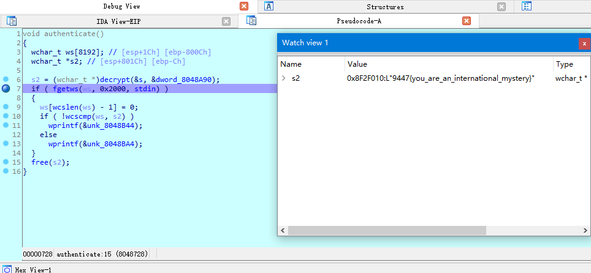

[TOC]

## 方法1
Exeinfo 看了是elf文件，没壳。 扔IDA找到关键函数。

```c
wchar_t *__cdecl decrypt(wchar_t *key1, wchar_t *key2)
{
  size_t key1_len2; // eax
  signed int j; // [esp+1Ch] [ebp-1Ch]
  signed int i; // [esp+20h] [ebp-18h]
  signed int key1_len; // [esp+24h] [ebp-14h]
  signed int key2_len; // [esp+28h] [ebp-10h]
  wchar_t *dest; // [esp+2Ch] [ebp-Ch]

  key1_len = wcslen(key1);
  key2_len = wcslen(key2);
  key1_len2 = wcslen(key1);
  dest = (wchar_t *)malloc(key1_len2 + 1);
  wcscpy(dest, key1);
  while ( j < key1_len )
  {
    for ( i = 0; i < key2_len && j < key1_len; ++i )
      dest[j++] -= key2[i];
  }
  return dest; // 光标在这里看tab
}
```

```asm
.text:080486F7 loc_80486F7:                            ; CODE XREF: decrypt+55↑j
.text:080486F7                                         ; decrypt+95↑j
.text:080486F7                 mov     eax, [ebp+j]
.text:080486FA                 cmp     eax, [ebp+key1_len]
.text:080486FD                 jl      short loc_80486AF
.text:080486FF                 mov     eax, [ebp+dest] ; ------ 将结果保存到eax了。看这里解决 080486FF
.text:08048702                 add     esp, 34h
.text:08048705                 pop     ebx
.text:08048706                 pop     ebp
.text:08048707                 retn
```
分析起来麻烦，直接gdb载入吧。

下断点

    b *0x080486FF 
    # 运行
    r 
    # info register
    i r
    # x/5sw $eax：查看eax开始的4个8字节内容（b：单字节，h：双字节，w：四字节，g：八字节；x：十六进制，s：字符串输出，i：反汇编，c：单字符）
    # 代码里都是用w的，所以用w看正好。 4字节
    x/5sw $eax

    # x/200w $eax 看也行。需要转换成char

## 方法2 配合IDA python脚本

IDA 分析到 `decrypt(&s, &dword_8048A90);` 

```c
wchar_t *__cdecl decrypt(wchar_t *s, wchar_t *a2)
{
  size_t tmp_len1; // eax
  signed int j; // [esp+1Ch] [ebp-1Ch]
  signed int i; // [esp+20h] [ebp-18h]
  signed int len1; // [esp+24h] [ebp-14h]
  signed int len2; // [esp+28h] [ebp-10h]
  wchar_t *dest; // [esp+2Ch] [ebp-Ch]

  len1 = wcslen(s);
  len2 = wcslen(a2);
  tmp_len1 = wcslen(s);
  dest = (wchar_t *)malloc(tmp_len1 + 1);
  wcscpy(dest, s);
  while ( j < len1 )
  {
    for ( i = 0; i < len2 && j < len1; ++i )
      dest[j++] -= a2[i];
  }
  return dest;
}
```
双击s，进入按*键 长度为6

双击dword_8048A90，进入按*键 长度为39

```python
addr=0x08048A90
arr=[]
for i in range(6):
    arr.append(Dword(addr+4*i))
print(arr)
# [5121L, 5122L, 5123L, 5124L, 5125L, 0L]

addr=0x08048AA8
arr=[]
for i in range(39): # 数组的个数
    arr.append(Dword(addr+4*i))
print(arr)
# [5178L, 5174L, 5175L, 5179L, 5248L, 5242L, 5233L, 5240L, 5219L, 5222L, 5235L, 5223L, 5218L, 5221L, 5235L, 5216L, 5227L, 5233L, 5240L, 5226L, 5235L, 5232L, 5220L, 5240L, 5230L, 5232L, 5232L, 5220L, 5232L, 5220L, 5230L, 5243L, 5238L, 5240L, 5226L, 5235L, 5243L, 5248L, 0L]
```

字串末尾会以0结尾。去掉

```python
key = [5121, 5122, 5123, 5124, 5125]
dest = [5178, 5174, 5175, 5179, 5248, 5242, 5233, 5240, 5219, 5222, 5235, 5223, 5218, 5221, 5235, 5216, 5227, 5233, 5240, 5226, 5235, 5232, 5220, 5240, 5230, 5232, 5232, 5220, 5232, 5220, 5230, 5243, 5238, 5240, 5226, 5235, 5243, 5248]
i = j = 0
while i < len(dest):
    j = 0
    while i < len(dest) and j < len(key):
        dest[i] -= key[j]
        i += 1
        j += 1

print(''.join(chr(x) for x in dest))
```

## 方法3 IDA远程调试

Windows 下的 IDA     

1. 在 IDA 的安装目录/dbgsrc/找到 linux_server 和 linux_serverx64 拷贝到 linux 虚拟机中

2. 在 linux 中运行 linux_server => ./linux_server

3. Debugger -- Attach -- Remote Linux debbuger

4. 配置客户端调试选项


路径默认是 linux_server 的位置, 放在同文件夹下可直接使用文件名。 否则使用全路径名。 / 开头

比如, /mnt/hgfs/vmware/dbg/runthis 或直接使用 runthis

配置好调试的服务端后，接下来开始配置客户端IDA，正常启动IDA打开【Debugger】-【Run】-【Remote Linux debugger】来设置调试选项


在s2后下断点，运行程序。

__4.1 方式1 用watch view看__

debugger-debugger window-  watch view, 添加s2到watch view。



__4.2 方式2 使用python脚本__

在s2处按tab，可知结果放到eax中。在断点处Shift+F2，Language 选Python。执行Python脚本

```python
addr = 0x09293820
ans = ''
for tempAddr in range(addr ,addr+50*4, 4):
    ans += get_bytes(tempAddr,1)
print(ans)
```


结果在output 窗口。